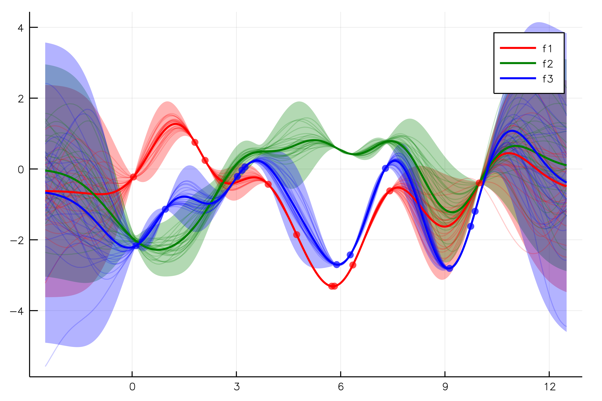
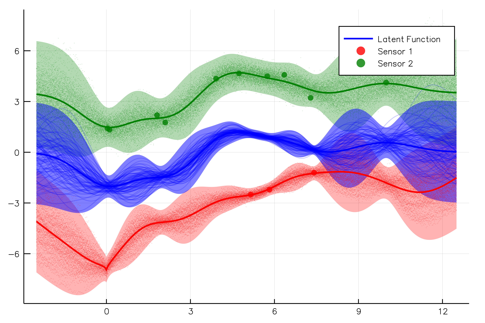

# Stheno

[](https://travis-ci.org/willtebbutt/Stheno.jl)[](https://ci.appveyor.com/project/willtebbutt/stheno-jl/branch/master)[](http://codecov.io/github/willtebbutt/Stheno.jl?branch=master)

Stheno is designed to make doing non-standard things with Gaussian processes straightforward. It has an intuitive modeling syntax, is inherently able to handle both multi-input and multi-output problems, trivially supports interdomain pseudo-point approximations, and has _some_ support for structure-exploiting algebra.

[We also have a Python version of the package](https://github.com/wesselb/stheno)

~~A technical report / pre-print detailing this work will be made available before Christmas 2018.~~ Stheno is currently undergoing substantial refactoring. Consequently this pre-print has been delayed :(

## A Couple of Examples

First, a note for statistics / ML people who aren't too familiar with Julia: the first execution of the examples below will take a while as Julia has to compile the code. On subsequent runs (e.g. if you were repeatedly evaluating the `logpdf` for kernel parameter learning) it will progress _much_ faster.

In this first example we define a simple Gaussian process, make observations of different bits of it, and visualise the posterior. We are trivially able to condition on both observations of both `f₁` _and_ `f₃`, which is a very non-standard capability.
```julia
using Stheno, Random
using Stheno: @model

# Explicitly set pseudo-randomness for reproducibility.
rng = MersenneTwister(123456)

# Define a distribution over f₁, f₂, and f₃, where f₃(x) = f₁(x) + f₂(x).
@model function model()
    f₁ = GP(ConstantMean(randn(rng)), EQ())
    f₂ = GP(EQ())
    f₃ = f₁ + f₂
    return f₁, f₂, f₃
end
f₁, f₂, f₃ = model()

# Generate some toy observations of `f₁` and `f₃`.
X₁, X₃ = sort(rand(rng, 10) * 10), sort(rand(rng, 11) * 10)
ŷ₁, ŷ₃ = rand(rng, [f₁(X₁), f₃(X₃)])

# Compute the posterior processes.
(f₁′, f₂′, f₃′) = (f₁, f₂, f₃) | (f₁(X₁)←ŷ₁, f₃(X₃)←ŷ₃)

# Sample jointly from the posterior processes and compute posterior marginals.
Xp = range(-2.5, stop=12.5, length=500)
f₁′Xp, f₂′Xp, f₃′Xp = rand(rng, [f₁′(Xp), f₂′(Xp), f₃′(Xp)], 25)
μf₁′, σf₁′ = marginals(f₁′(Xp))
μf₂′, σf₂′ = marginals(f₂′(Xp))
μf₃′, σf₃′ = marginals(f₃′(Xp))
```


In the above figure, we have visualised the posterior distribution of all of the processes. Bold lines are posterior means, and shaded areas are three posterior standard deviations from these means. Thin lines are samples from the posterior processes.

In this next example we make observations of two different noisy versions of the same latent process. Again, this is just about doable in existing GP packages if you know what you're doing, but isn't straightforward.

```julia
using Stheno, Random
using Stheno: @model

# Explicitly set pseudo-randomness for reproducibility.
rng = MersenneTwister(123456)

@model function model()

    # A smooth latent function.
    f = GP(EQ())

    # Two noisy processes.
    noise1 = GP(CustomMean(x->sin.(x) .- 5.0 .+ sqrt.(abs.(x))), Noise(1e-2))
    noise2 = GP(ConstantMean(3.5), Noise(1e-1))

    # Noise-corrupted versions of `f`.
    y₁ = f + noise1
    y₂ = f + noise2

    return f, noise1, noise2, y₁, y₂
end
f, noise1, noise2, y₁, y₂ = model()

# Generate some toy observations of `y₁` and `y₂`.
X₁, X₂ = sort(rand(rng, 3) * 10), sort(rand(rng, 10) * 10)
ŷ₁, ŷ₂ = rand(rng, [y₁(X₁), y₂(X₂)])

# Compute the posterior processes.
(f′, y₁′, y₂′) = (f, y₁, y₂) | (y₁(X₁)←ŷ₁, y₂(X₂)←ŷ₂)

# Sample jointly from the posterior processes and compute posterior marginals.
Xp = range(-2.5, stop=12.5, length=500)
f′Xp, y₁′Xp, y₂′Xp = rand(rng, [f′(Xp), y₁′(Xp), y₂′(Xp)], 100)
μf′, σf′ = marginals(f′(Xp))
μy₁′, σy₁′ = marginals(y₁′(Xp))
μy₂′, σy₂′ = marginals(y₂′(Xp))
```


As before, we visualise the posterior distribution through its marginal statistics and joint samples. Note that the posterior samples over the unobserved process are (unsurprisingly) smooth, whereas the posterior samples over the noisy processes still look uncorrelated and noise-like.


## Performance, scalability, etc

Stheno (currently) makes no claims regarding performance or scalability relative to existing Gaussian process packages. It should be viewed as a (hopefully interesting) baseline implementation for solving small-ish problems. We do provide a baseline implementation of (inter-domain) pseudo-point approximations, and can exploit Toeplitz structure in covariance matrices, but these have yet to be fully optimised.


## Non-Gaussian problems

Stheno is designed for jointly Gaussian problems, and there are no plans to support non-Gaussian likelihoods in the core package. The official stance (if you can call it that) is that since Stheno is trivially compatible with [Turing.jl](https://github.com/TuringLang/), and one should simply embed a Stheno model within a Turing model to solve non-Gaussian problems.

Example usage will be made available in the near future.

This is not to say that there would be no value in the creation of a separate package that extends Stheno to handle, for example, non-Gaussian likelihoods.

## GPs + Deep Learning

The plan is again not to support the combination of GPs and Deep Learning explicitly, but rather to ensure that Stheno and [Flux.jl](https://github.com/FluxML/Flux.jl) play nicely with one another. Once the AD-related issues below have been resolved, example usage will be provided.

## The Elephant in the Room
You can't currently perform gradient-based kernel parameter optimisation in Stheno. This an automatic-differentiation related issue, which will definitely be resolved in the 1.0 timeline, once [Capstan.jl](https://github.com/JuliaDiff/Capstan.jl) or some other [Cassette.jl](https://github.com/jrevels/Cassette.jl)-based AD package is available, and [DiffRules.jl](https://github.com/JuliaDiff/DiffRules.jl) has support for Linear Algebra primitives. There's not a lot more to say than that really. Apologies.

## Things that are definitely up for grabs
Obviously, improvements to code documentation are always welcome, and if you want to write some more unit / integration tests, please feel free. In terms of larger items that require some attention, here are some thoughts:
- Plotting recipes: there is currently a lot of _highly_ repetitive code for plotting the posterior distribution over 1D GPs. This needn't be the case, and it would be a (presumably) simple job for someone who knows what they're doing with the [Plots.jl](https://github.com/JuliaPlots/Plots.jl) recipes to make most of that code disappear. 
- An implementation of SVI from [Gaussian Processes for Big Data](https://arxiv.org/abs/1309.6835).
- Kronecker-factored matrices: this is quite a general issue which might be best be addressed by the creation of a separate package. It would be very helpful to have an implementation of the `AbstractMatrix` interface which implements multiplication, inversion, eigenfactorisation etc, which can then be utilised in Stheno.
- All the Stochastic Differential Equation representation of GP related optimisations. See Arno Solin's thesis for a primer. This is quite a big problem that should probably be tackled in pieces.
- Primitives for multi-output GPs: although Stheno does fundamentally have support for multi-output GPs, in the same way that it's helpful to implement so-called "fat" nodes in Automatic Differentiation systems, it may well be helpful to implement specialised multi-output processes in Stheno for performance's sake.
- Moving stuff from the `src/util` directory to the appropriate upstream package. There are two candidates here: block_arrays.jl and toeplitz.jl being moved to BlockArrays.jl and Toeplitz.jl respectively. This will likely involve making significant changes to the existing code such that it satisfies the requirements of both Stheno, and the relevant upstream package. This is a slightly strange item as it will ultimately involve removing a significant amount of code from Stheno. This is a good thing though.
- Some decent benchmarks: development has not focused on performance so far, but it would be extremely helpful to have a wide range of benchmarks so that we can begin to ensure that time is spent optimally. This would involve comparing against [GaussianProcesses.jl](https://github.com/STOR-i/GaussianProcesses.jl), but also some other non-Julia packages.

If you are interested in any of the above, please either open an issue or PR. Better still, if there's something not listed here that you think would be good to see, please open an issue to start a discussion regarding it.
