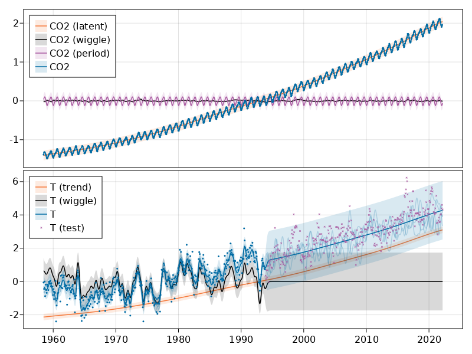

```@meta
EditURL = "<unknown>/examples/extended_mauna_loa/script.jl"
```

# CO2 and temperature

[](<unknown>/examples/extended_mauna_loa.ipynb)

*You are seeing the
HTML output generated by [Documenter.jl](https://github.com/JuliaDocs/Documenter.jl) and
[Literate.jl](https://github.com/fredrikekre/Literate.jl) from the
[Julia source file](<unknown>/examples/extended_mauna_loa/script.jl).
The corresponding notebook can be viewed in [nbviewer](<unknown>/examples/extended_mauna_loa.ipynb).*

````julia
using AbstractGPs
using AbstractGPsMakie
using CairoMakie
using CSV
using DataDeps
using DataFrames
using Dates
using Distributions
using KernelFunctions
using LinearAlgebra
using Optim
using ParameterHandling
using Random
using Statistics
using Stheno
using Zygote

using CairoMakie: RGB

ENV["DATADEPS_ALWAYS_ACCEPT"] = "true"
````

````
"true"
````

## Obtain the data

Use DataDeps.jl to obtain the data.

````julia
register(DataDep(
    "mauna_loa",
    "The classic Mauna Loa CO2 data.",
    "https://scrippsco2.ucsd.edu/assets/data/atmospheric/stations/in_situ_co2/monthly/" *
        "monthly_in_situ_co2_mlo.csv",
))
register(DataDep(
    "hadcrut5_global",
    "Globally-averaged surface temperatures",
    "https://www.metoffice.gov.uk/hadobs/hadcrut5/data/current/analysis/diagnostics/" *
        "HadCRUT.5.0.1.0.analysis.summary_series.global.monthly.csv",
))
````

````
DataDeps.DataDep{Nothing, String, typeof(DataDeps.fetch_default), typeof(identity)}("hadcrut5_global", "https://www.metoffice.gov.uk/hadobs/hadcrut5/data/current/analysis/diagnostics/HadCRUT.5.0.1.0.analysis.summary_series.global.monthly.csv", nothing, DataDeps.fetch_default, identity, "Globally-averaged surface temperatures")
````

Load and pre-process the data.

````julia
ml_df, Ttr_df, Tte_df = let

    mauna_loa_co2 = let
        mauna_loa_data_raw = CSV.read(
            joinpath(datadep"mauna_loa", "monthly_in_situ_co2_mlo.csv"), DataFrame;
            skipto=58, header=false,
        )

        data = DataFrame(
            date=map(Date, mauna_loa_data_raw.Column1, mauna_loa_data_raw.Column2),
            CO2=map(x -> x == -99.99 ? missing : x, mauna_loa_data_raw.Column5),
        )
        data = filter(:CO2 => !ismissing, data)

        # standardise CO2 data to have unit mean.
        m = mean(data.CO2)
        σ = std(data.CO2)
        data.CO2 = Float64.(data.CO2 .- m) ./ σ

        # Convert dates into floats.
        data.float_date = map(x -> x.value, data.date .- Date(1)) ./ 365

        data
    end

    temperature = let
        hadcrut5_data_raw = CSV.read(
            joinpath(
                datadep"hadcrut5_global",
                "HadCRUT.5.0.1.0.analysis.summary_series.global.monthly.csv",
            ),
            DataFrame;
            header=1,
        )

        tmp = DataFrame(
            date=hadcrut5_data_raw[!, "Time"],
            temperature=hadcrut5_data_raw[!, "Anomaly (deg C)"],
        )

        # Convert dates into floats.
        tmp.float_date = map(x -> x.value, tmp.date .- Date(1)) ./ 365

        # Remove any data from before the first Mauna Loa data.
        time_min = minimum(mauna_loa_co2.date)
        filter(:date => date -> date >= time_min, tmp)
    end

    # Split temperature data into train and test.
    Ntr = 425
    Ttr_raw = temperature[1:Ntr, :]
    Tte_raw = temperature[(Ntr + 1):end, :]

    # Standard temperature data using training data.
    mtr = mean(Ttr_raw.temperature)
    σtr = std(Ttr_raw.temperature)
    Ttr = DataFrame(
        date=Ttr_raw.date,
        float_date=Ttr_raw.float_date,
        temperature=(Ttr_raw.temperature .- mtr) ./ σtr,
    )
    Tte = DataFrame(
        date=Tte_raw.date,
        float_date=Tte_raw.float_date,
        temperature=(Tte_raw.temperature .- mtr) ./ σtr,
    )

    mauna_loa_co2, Ttr, Tte
end
````

````
(758×3 DataFrame
 Row │ date        CO2           float_date
     │ Date        Float64       Float64
─────┼──────────────────────────────────────
   1 │ 1958-03-01  -1.38413         1958.46
   2 │ 1958-04-01  -1.32526         1958.55
   3 │ 1958-05-01  -1.32323         1958.63
   4 │ 1958-07-01  -1.37906         1958.79
   5 │ 1958-08-01  -1.41053         1958.88
   6 │ 1958-09-01  -1.46873         1958.96
   7 │ 1958-11-01  -1.46467         1959.13
   8 │ 1958-12-01  -1.41933         1959.21
   9 │ 1959-01-01  -1.38853         1959.3
  10 │ 1959-02-01  -1.35774         1959.38
  11 │ 1959-03-01  -1.35233         1959.46
  12 │ 1959-04-01  -1.31612         1959.55
  13 │ 1959-05-01  -1.29683         1959.63
  14 │ 1959-06-01  -1.30157         1959.71
  15 │ 1959-07-01  -1.35605         1959.79
  16 │ 1959-08-01  -1.41493         1959.88
  17 │ 1959-09-01  -1.44741         1959.96
  18 │ 1959-10-01  -1.46467         1960.05
  19 │ 1959-11-01  -1.41459         1960.13
  20 │ 1959-12-01  -1.38853         1960.21
  21 │ 1960-01-01  -1.35977         1960.3
  22 │ 1960-02-01  -1.34116         1960.38
  23 │ 1960-03-01  -1.32086         1960.46
  24 │ 1960-04-01  -1.27179         1960.55
  25 │ 1960-05-01  -1.23796         1960.63
  26 │ 1960-06-01  -1.25285         1960.72
  27 │ 1960-07-01  -1.30056         1960.8
  28 │ 1960-08-01  -1.37771         1960.88
  29 │ 1960-09-01  -1.43624         1960.97
  30 │ 1960-10-01  -1.44775         1961.05
  31 │ 1960-11-01  -1.40816         1961.13
  32 │ 1960-12-01  -1.36789         1961.22
  33 │ 1961-01-01  -1.34421         1961.3
  34 │ 1961-02-01  -1.3168          1961.39
  35 │ 1961-03-01  -1.28837         1961.46
  36 │ 1961-04-01  -1.25657         1961.55
  37 │ 1961-05-01  -1.21935         1961.63
  38 │ 1961-06-01  -1.24676         1961.72
  39 │ 1961-07-01  -1.2877          1961.8
  40 │ 1961-08-01  -1.34759         1961.88
  41 │ 1961-09-01  -1.4085          1961.97
  42 │ 1961-10-01  -1.39767         1962.05
  43 │ 1961-11-01  -1.37094         1962.13
  44 │ 1961-12-01  -1.34015         1962.22
  45 │ 1962-01-01  -1.30868         1962.3
  46 │ 1962-02-01  -1.28804         1962.39
  47 │ 1962-03-01  -1.2498          1962.46
  48 │ 1962-04-01  -1.21969         1962.55
  49 │ 1962-05-01  -1.20446         1962.63
  50 │ 1962-06-01  -1.21799         1962.72
  51 │ 1962-07-01  -1.25217         1962.8
  52 │ 1962-08-01  -1.32695         1962.88
  53 │ 1962-09-01  -1.36586         1962.97
  54 │ 1962-10-01  -1.39395         1963.05
  55 │ 1962-11-01  -1.35097         1963.13
  56 │ 1962-12-01  -1.3168          1963.22
  57 │ 1963-01-01  -1.28161         1963.3
  58 │ 1963-02-01  -1.27044         1963.39
  59 │ 1963-03-01  -1.24371         1963.46
  60 │ 1963-04-01  -1.19228         1963.55
  61 │ 1963-05-01  -1.16284         1963.63
  62 │ 1963-06-01  -1.18889         1963.72
  63 │ 1963-07-01  -1.24777         1963.8
  64 │ 1963-08-01  -1.31443         1963.88
  65 │ 1963-09-01  -1.36722         1963.97
  66 │ 1963-10-01  -1.37466         1964.05
  67 │ 1963-11-01  -1.33812         1964.13
  68 │ 1963-12-01  -1.2948          1964.22
  69 │ 1964-01-01  -1.25352         1964.3
  70 │ 1964-05-01  -1.16284         1964.63
  71 │ 1964-06-01  -1.17502         1964.72
  72 │ 1964-07-01  -1.22408         1964.8
  73 │ 1964-08-01  -1.2833          1964.88
  74 │ 1964-09-01  -1.3503          1964.97
  75 │ 1964-10-01  -1.34488         1965.05
  76 │ 1964-11-01  -1.31747         1965.14
  77 │ 1964-12-01  -1.28262         1965.22
  78 │ 1965-01-01  -1.25792         1965.3
  79 │ 1965-02-01  -1.22408         1965.39
  80 │ 1965-03-01  -1.20886         1965.47
  81 │ 1965-04-01  -1.16656         1965.55
  82 │ 1965-05-01  -1.16555         1965.63
  83 │ 1965-06-01  -1.1757          1965.72
  84 │ 1965-07-01  -1.19803         1965.8
  85 │ 1965-08-01  -1.27721         1965.88
  86 │ 1965-09-01  -1.31274         1965.97
  87 │ 1965-10-01  -1.33033         1966.05
  88 │ 1965-11-01  -1.27721         1966.14
  89 │ 1965-12-01  -1.2586          1966.22
  90 │ 1966-01-01  -1.21799         1966.3
  91 │ 1966-02-01  -1.18483         1966.39
  92 │ 1966-03-01  -1.1581          1966.47
  93 │ 1966-04-01  -1.11377         1966.55
  94 │ 1966-05-01  -1.10092         1966.63
  95 │ 1966-06-01  -1.11208         1966.72
  96 │ 1966-07-01  -1.15844         1966.8
  97 │ 1966-08-01  -1.22679         1966.88
  98 │ 1966-09-01  -1.28499         1966.97
  99 │ 1966-10-01  -1.30326         1967.05
 100 │ 1966-11-01  -1.24642         1967.14
 101 │ 1966-12-01  -1.20412         1967.22
 102 │ 1967-01-01  -1.16013         1967.3
 103 │ 1967-02-01  -1.15438         1967.39
 104 │ 1967-03-01  -1.13611         1967.47
 105 │ 1967-04-01  -1.08941         1967.55
 106 │ 1967-05-01  -1.06979         1967.63
 107 │ 1967-06-01  -1.10058         1967.72
 108 │ 1967-07-01  -1.15303         1967.8
 109 │ 1967-08-01  -1.20784         1967.88
 110 │ 1967-09-01  -1.26435         1967.97
 111 │ 1967-10-01  -1.25961         1968.05
 112 │ 1967-11-01  -1.21427         1968.14
 113 │ 1967-12-01  -1.17265         1968.22
 114 │ 1968-01-01  -1.15201         1968.3
 115 │ 1968-02-01  -1.13239         1968.39
 116 │ 1968-03-01  -1.10735         1968.47
 117 │ 1968-04-01  -1.06911         1968.55
 118 │ 1968-05-01  -1.0505          1968.64
 119 │ 1968-06-01  -1.0576          1968.72
 120 │ 1968-07-01  -1.09889         1968.8
 121 │ 1968-08-01  -1.16758         1968.89
 122 │ 1968-09-01  -1.22781         1968.97
 123 │ 1968-10-01  -1.23051         1969.05
 124 │ 1968-11-01  -1.19431         1969.14
 125 │ 1968-12-01  -1.14118         1969.22
 126 │ 1969-01-01  -1.10362         1969.31
 127 │ 1969-02-01  -1.08941         1969.39
 128 │ 1969-03-01  -1.04847         1969.47
 129 │ 1969-04-01  -1.01362         1969.55
 130 │ 1969-05-01  -0.989253        1969.64
 131 │ 1969-06-01  -1.01192         1969.72
 132 │ 1969-07-01  -1.04001         1969.8
 133 │ 1969-08-01  -1.11513         1969.89
 134 │ 1969-09-01  -1.15844         1969.97
 135 │ 1969-10-01  -1.17874         1970.05
 136 │ 1969-11-01  -1.14254         1970.14
 137 │ 1969-12-01  -1.09956         1970.22
 138 │ 1970-01-01  -1.06776         1970.31
 139 │ 1970-02-01  -1.03663         1970.39
 140 │ 1970-03-01  -1.00448         1970.47
 141 │ 1970-04-01  -0.963875        1970.55
 142 │ 1970-05-01  -0.965567        1970.64
 143 │ 1970-06-01  -0.979441        1970.72
 144 │ 1970-07-01  -1.02444         1970.8
 145 │ 1970-08-01  -1.08061         1970.89
 146 │ 1970-09-01  -1.13408         1970.97
 147 │ 1970-10-01  -1.13509         1971.05
 148 │ 1970-11-01  -1.10329         1971.14
 149 │ 1970-12-01  -1.06539         1971.22
 150 │ 1971-01-01  -1.0302          1971.31
 151 │ 1971-02-01  -1.01294         1971.39
 152 │ 1971-03-01  -0.996021        1971.47
 153 │ 1971-04-01  -0.97538         1971.55
 154 │ 1971-05-01  -0.936806        1971.64
 155 │ 1971-06-01  -0.948987        1971.72
 156 │ 1971-07-01  -0.98993         1971.8
 157 │ 1971-08-01  -1.05524         1971.89
 158 │ 1971-09-01  -1.12528         1971.97
 159 │ 1971-10-01  -1.11851         1972.05
 160 │ 1971-11-01  -1.07655         1972.14
 161 │ 1971-12-01  -1.03561         1972.22
 162 │ 1972-01-01  -1.00989         1972.31
 163 │ 1972-02-01  -0.980794        1972.39
 164 │ 1972-03-01  -0.976734        1972.47
 165 │ 1972-04-01  -0.910074        1972.56
 166 │ 1972-05-01  -0.898231        1972.64
 167 │ 1972-06-01  -0.931392        1972.72
 168 │ 1972-07-01  -0.966921        1972.81
 169 │ 1972-08-01  -1.02512         1972.89
 170 │ 1972-09-01  -1.0752          1972.98
 171 │ 1972-10-01  -1.06302         1973.06
 172 │ 1972-11-01  -1.01903         1973.14
 173 │ 1972-12-01  -0.983501        1973.22
 174 │ 1973-01-01  -0.949664        1973.31
 175 │ 1973-02-01  -0.915488        1973.39
 176 │ 1973-03-01  -0.890449        1973.47
 177 │ 1973-04-01  -0.849844        1973.56
 178 │ 1973-05-01  -0.816683        1973.64
 179 │ 1973-06-01  -0.830557        1973.72
 180 │ 1973-07-01  -0.871161        1973.81
 181 │ 1973-08-01  -0.923947        1973.89
 182 │ 1973-09-01  -0.984516        1973.98
 183 │ 1973-10-01  -0.995682        1974.06
 184 │ 1973-11-01  -0.962522        1974.14
 185 │ 1973-12-01  -0.94628         1974.22
 186 │ 1974-01-01  -0.922256        1974.31
 187 │ 1974-02-01  -0.876575        1974.39
 188 │ 1974-03-01  -0.850182        1974.47
 189 │ 1974-04-01  -0.810931        1974.56
 190 │ 1974-05-01  -0.795704        1974.64
 191 │ 1974-06-01  -0.824127        1974.72
 192 │ 1974-07-01  -0.860672        1974.81
 193 │ 1974-08-01  -0.920902        1974.89
 194 │ 1974-09-01  -0.987223        1974.98
 195 │ 1974-10-01  -0.989253        1975.06
 196 │ 1974-11-01  -0.952709        1975.14
 197 │ 1974-12-01  -0.914811        1975.22
 198 │ 1975-01-01  -0.886726        1975.31
 199 │ 1975-02-01  -0.852889        1975.39
 200 │ 1975-03-01  -0.831233        1975.47
 201 │ 1975-04-01  -0.78826         1975.56
 202 │ 1975-05-01  -0.765927        1975.64
 203 │ 1975-06-01  -0.778447        1975.72
 204 │ 1975-07-01  -0.835971        1975.81
 205 │ 1975-08-01  -0.898569        1975.89
 206 │ 1975-09-01  -0.948987        1975.98
 207 │ 1975-10-01  -0.956431        1976.06
 208 │ 1975-11-01  -0.917518        1976.14
 209 │ 1975-12-01  -0.874545        1976.22
 210 │ 1976-01-01  -0.841046        1976.31
 211 │ 1976-02-01  -0.8133          1976.39
 212 │ 1976-03-01  -0.782169        1976.47
 213 │ 1976-04-01  -0.745287        1976.56
 214 │ 1976-05-01  -0.735135        1976.64
 215 │ 1976-06-01  -0.753746        1976.73
 216 │ 1976-07-01  -0.797058        1976.81
 217 │ 1976-08-01  -0.868454        1976.89
 218 │ 1976-09-01  -0.923947        1976.98
 219 │ 1976-10-01  -0.936129        1977.06
 220 │ 1976-11-01  -0.889772        1977.15
 221 │ 1976-12-01  -0.843415        1977.23
 222 │ 1977-01-01  -0.801118        1977.31
 223 │ 1977-02-01  -0.784538        1977.4
 224 │ 1977-03-01  -0.741226        1977.47
 225 │ 1977-04-01  -0.694869        1977.56
 226 │ 1977-05-01  -0.67186         1977.64
 227 │ 1977-06-01  -0.688102        1977.73
 228 │ 1977-07-01  -0.733782        1977.81
 229 │ 1977-08-01  -0.807209        1977.89
 230 │ 1977-09-01  -0.84646         1977.98
 231 │ 1977-10-01  -0.86101         1978.06
 232 │ 1977-11-01  -0.819052        1978.15
 233 │ 1977-12-01  -0.769988        1978.23
 234 │ 1978-01-01  -0.73209         1978.31
 235 │ 1978-02-01  -0.717878        1978.4
 236 │ 1978-03-01  -0.675582        1978.47
 237 │ 1978-04-01  -0.637684        1978.56
 238 │ 1978-05-01  -0.629225        1978.64
 239 │ 1978-06-01  -0.632947        1978.73
 240 │ 1978-07-01  -0.678966        1978.81
 241 │ 1978-08-01  -0.741903        1978.89
 242 │ 1978-09-01  -0.80687         1978.98
 243 │ 1978-10-01  -0.813976        1979.06
 244 │ 1978-11-01  -0.767619        1979.15
 245 │ 1978-12-01  -0.732767        1979.23
 246 │ 1979-01-01  -0.689455        1979.31
 247 │ 1979-02-01  -0.671521        1979.4
 248 │ 1979-03-01  -0.630917        1979.47
 249 │ 1979-04-01  -0.599786        1979.56
 250 │ 1979-05-01  -0.579822        1979.64
 251 │ 1979-06-01  -0.585913        1979.73
 252 │ 1979-07-01  -0.638699        1979.81
 253 │ 1979-08-01  -0.694192        1979.89
 254 │ 1979-09-01  -0.767619        1979.98
 255 │ 1979-10-01  -0.769649        1980.06
 256 │ 1979-11-01  -0.721262        1980.15
 257 │ 1979-12-01  -0.672536        1980.23
 258 │ 1980-01-01  -0.628886        1980.31
 259 │ 1980-02-01  -0.617382        1980.4
 260 │ 1980-03-01  -0.559182        1980.48
 261 │ 1980-04-01  -0.535834        1980.56
 262 │ 1980-05-01  -0.512148        1980.64
 263 │ 1980-06-01  -0.522299        1980.73
 264 │ 1980-07-01  -0.576777        1980.81
 265 │ 1980-08-01  -0.643098        1980.9
 266 │ 1980-09-01  -0.70096         1980.98
 267 │ 1980-10-01  -0.696561        1981.06
 268 │ 1980-11-01  -0.659678        1981.15
 269 │ 1980-12-01  -0.622119        1981.23
 270 │ 1981-01-01  -0.587605        1981.32
 271 │ 1981-02-01  -0.545308        1981.4
 272 │ 1981-03-01  -0.514855        1981.48
 273 │ 1981-04-01  -0.476957        1981.56
 274 │ 1981-05-01  -0.463084        1981.64
 275 │ 1981-06-01  -0.485416        1981.73
 276 │ 1981-07-01  -0.545308        1981.81
 277 │ 1981-08-01  -0.614675        1981.9
 278 │ 1981-09-01  -0.673552        1981.98
 279 │ 1981-10-01  -0.667799        1982.06
 280 │ 1981-11-01  -0.617043        1982.15
 281 │ 1981-12-01  -0.574747        1982.23
 282 │ 1982-01-01  -0.536172        1982.32
 283 │ 1982-02-01  -0.507072        1982.4
 284 │ 1982-03-01  -0.47019         1982.48
 285 │ 1982-04-01  -0.440751        1982.56
 286 │ 1982-05-01  -0.421464        1982.64
 287 │ 1982-06-01  -0.448195        1982.73
 288 │ 1982-07-01  -0.492184        1982.81
 289 │ 1982-08-01  -0.567979        1982.9
 290 │ 1982-09-01  -0.629901        1982.98
 291 │ 1982-10-01  -0.633962        1983.06
 292 │ 1982-11-01  -0.58659         1983.15
 293 │ 1982-12-01  -0.54497         1983.23
 294 │ 1983-01-01  -0.514855        1983.32
 295 │ 1983-02-01  -0.47628         1983.4
 296 │ 1983-03-01  -0.456655        1983.48
 297 │ 1983-04-01  -0.394394        1983.56
 298 │ 1983-05-01  -0.366647        1983.64
 299 │ 1983-06-01  -0.381536        1983.73
 300 │ 1983-07-01  -0.426878        1983.81
 301 │ 1983-08-01  -0.481017        1983.9
 302 │ 1983-09-01  -0.565949        1983.98
 303 │ 1983-10-01  -0.562227        1984.06
 304 │ 1983-11-01  -0.522976        1984.15
 305 │ 1983-12-01  -0.461053        1984.23
 306 │ 1984-01-01  -0.432969        1984.32
 307 │ 1984-02-01  -0.405899        1984.4
 308 │ 1984-03-01  -0.379844        1984.48
 309 │ 1984-04-01  -0.32029         1984.56
 310 │ 1984-05-01  -0.307771        1984.65
 311 │ 1984-06-01  -0.329426        1984.73
 312 │ 1984-07-01  -0.377137        1984.81
 313 │ 1984-08-01  -0.44921         1984.9
 314 │ 1984-09-01  -0.523991        1984.98
 315 │ 1984-10-01  -0.514855        1985.07
 316 │ 1984-11-01  -0.460038        1985.15
 317 │ 1984-12-01  -0.418418        1985.23
 318 │ 1985-01-01  -0.393379        1985.32
 319 │ 1985-02-01  -0.358865        1985.4
 320 │ 1985-03-01  -0.310816        1985.48
 321 │ 1985-04-01  -0.280024        1985.56
 322 │ 1985-05-01  -0.260398        1985.65
 323 │ 1985-06-01  -0.283408        1985.73
 324 │ 1985-07-01  -0.340931        1985.81
 325 │ 1985-08-01  -0.405222        1985.9
 326 │ 1985-09-01  -0.458685        1985.98
 327 │ 1985-10-01  -0.468498        1986.07
 328 │ 1985-11-01  -0.419772        1986.15
 329 │ 1985-12-01  -0.375107        1986.23
 330 │ 1986-01-01  -0.349729        1986.32
 331 │ 1986-02-01  -0.327735        1986.4
 332 │ 1986-03-01  -0.297281        1986.48
 333 │ 1986-04-01  -0.239758        1986.56
 334 │ 1986-05-01  -0.217425        1986.65
 335 │ 1986-06-01  -0.239758        1986.73
 336 │ 1986-07-01  -0.294236        1986.81
 337 │ 1986-08-01  -0.363264        1986.9
 338 │ 1986-09-01  -0.398793        1986.98
 339 │ 1986-10-01  -0.421802        1987.07
 340 │ 1986-11-01  -0.371385        1987.15
 341 │ 1986-12-01  -0.329426        1987.23
 342 │ 1987-01-01  -0.291529        1987.32
 343 │ 1987-02-01  -0.275625        1987.4
 344 │ 1987-03-01  -0.244156        1987.48
 345 │ 1987-04-01  -0.191032        1987.56
 346 │ 1987-05-01  -0.161594        1987.65
 347 │ 1987-06-01  -0.181558        1987.73
 348 │ 1987-07-01  -0.240773        1987.81
 349 │ 1987-08-01  -0.288483        1987.9
 350 │ 1987-09-01  -0.344315        1987.98
 351 │ 1987-10-01  -0.356158        1988.07
 352 │ 1987-11-01  -0.307094        1988.15
 353 │ 1987-12-01  -0.268181        1988.23
 354 │ 1988-01-01  -0.21844         1988.32
 355 │ 1988-02-01  -0.174113        1988.4
 356 │ 1988-03-01  -0.157533        1988.48
 357 │ 1988-04-01  -0.111176        1988.57
 358 │ 1988-05-01  -0.0895201       1988.65
 359 │ 1988-06-01  -0.103732        1988.73
 360 │ 1988-07-01  -0.151442        1988.82
 361 │ 1988-08-01  -0.217425        1988.9
 362 │ 1988-09-01  -0.27461         1988.99
 363 │ 1988-10-01  -0.269196        1989.07
 364 │ 1988-11-01  -0.22893         1989.15
 365 │ 1988-12-01  -0.185956        1989.24
 366 │ 1989-01-01  -0.137569        1989.32
 367 │ 1989-02-01  -0.12708         1989.41
 368 │ 1989-03-01  -0.1061          1989.48
 369 │ 1989-04-01  -0.0472235       1989.57
 370 │ 1989-05-01  -0.0387642       1989.65
 371 │ 1989-06-01  -0.0573747       1989.73
 372 │ 1989-07-01  -0.0986562       1989.82
 373 │ 1989-08-01  -0.174113        1989.9
 374 │ 1989-09-01  -0.237051        1989.99
 375 │ 1989-10-01  -0.23096         1990.07
 376 │ 1989-11-01  -0.186633        1990.15
 377 │ 1989-12-01  -0.145352        1990.24
 378 │ 1990-01-01  -0.106777        1990.32
 379 │ 1990-02-01  -0.0715864       1990.41
 380 │ 1990-03-01  -0.0482387       1990.48
 381 │ 1990-04-01  -0.0208305       1990.57
 382 │ 1990-05-01   0.0116533       1990.65
 383 │ 1990-06-01  -0.019477        1990.73
 384 │ 1990-07-01  -0.0675259       1990.82
 385 │ 1990-08-01  -0.132155        1990.9
 386 │ 1990-09-01  -0.197799        1990.99
 387 │ 1990-10-01  -0.190355        1991.07
 388 │ 1990-11-01  -0.134524        1991.15
 389 │ 1990-12-01  -0.0878283       1991.24
 390 │ 1991-01-01  -0.0705713       1991.32
 391 │ 1991-02-01  -0.0360572       1991.41
 392 │ 1991-03-01   0.0116533       1991.48
 393 │ 1991-04-01   0.060379        1991.57
 394 │ 1991-05-01   0.0854186       1991.65
 395 │ 1991-06-01   0.0481976       1991.73
 396 │ 1991-07-01  -0.0215072       1991.82
 397 │ 1991-08-01  -0.0949341       1991.9
 398 │ 1991-09-01  -0.157871        1991.99
 399 │ 1991-10-01  -0.155503        1992.07
 400 │ 1991-11-01  -0.103732        1992.15
 401 │ 1991-12-01  -0.0617736       1992.24
 402 │ 1992-01-01  -0.0279363       1992.32
 403 │ 1992-02-01  -0.00323508      1992.41
 404 │ 1992-03-01   0.0336476       1992.48
 405 │ 1992-04-01   0.0789895       1992.57
 406 │ 1992-05-01   0.0962465       1992.65
 407 │ 1992-06-01   0.0823732       1992.74
 408 │ 1992-07-01   0.00691611      1992.82
 409 │ 1992-08-01  -0.0614352       1992.9
 410 │ 1992-09-01  -0.128771        1992.99
 411 │ 1992-10-01  -0.11862         1993.07
 412 │ 1992-11-01  -0.0898585       1993.16
 413 │ 1992-12-01  -0.0479003       1993.24
 414 │ 1993-01-01  -0.00391182      1993.32
 415 │ 1993-02-01   0.0119917       1993.41
 416 │ 1993-03-01   0.0529348       1993.48
 417 │ 1993-04-01   0.0894791       1993.57
 418 │ 1993-05-01   0.117226        1993.65
 419 │ 1993-06-01   0.0942163       1993.74
 420 │ 1993-07-01   0.025865        1993.82
 421 │ 1993-08-01  -0.0435014       1993.9
 422 │ 1993-09-01  -0.105424        1993.99
 423 │ 1993-10-01  -0.0952725       1994.07
 424 │ 1993-11-01  -0.0499305       1994.16
 425 │ 1993-12-01   0.000148652     1994.24
 426 │ 1994-01-01   0.0532732       1994.32
 427 │ 1994-02-01   0.0715453       1994.41
 428 │ 1994-03-01   0.107413        1994.48
 429 │ 1994-04-01   0.151401        1994.57
 430 │ 1994-05-01   0.165613        1994.65
 431 │ 1994-06-01   0.140573        1994.74
 432 │ 1994-07-01   0.0935395       1994.82
 433 │ 1994-08-01   0.0234964       1994.9
 434 │ 1994-09-01  -0.0316584       1994.99
 435 │ 1994-10-01  -0.0265828       1995.07
 436 │ 1994-11-01   0.0272185       1995.16
 437 │ 1994-12-01   0.0766209       1995.24
 438 │ 1995-01-01   0.10809         1995.32
 439 │ 1995-02-01   0.142942        1995.41
 440 │ 1995-03-01   0.164598        1995.48
 441 │ 1995-04-01   0.226182        1995.57
 442 │ 1995-05-01   0.237686        1995.65
 443 │ 1995-06-01   0.219753        1995.74
 444 │ 1995-07-01   0.173734        1995.82
 445 │ 1995-08-01   0.0911709       1995.9
 446 │ 1995-09-01   0.0437987       1995.99
 447 │ 1995-10-01   0.0339859       1996.07
 448 │ 1995-11-01   0.094893        1996.16
 449 │ 1995-12-01   0.133468        1996.24
 450 │ 1996-01-01   0.179148        1996.32
 451 │ 1996-02-01   0.219753        1996.41
 452 │ 1996-03-01   0.246146        1996.49
 453 │ 1996-04-01   0.269493        1996.57
 454 │ 1996-05-01   0.293518        1996.65
 455 │ 1996-06-01   0.278291        1996.74
 456 │ 1996-07-01   0.233626        1996.82
 457 │ 1996-08-01   0.160199        1996.91
 458 │ 1996-09-01   0.0915093       1996.99
 459 │ 1996-10-01   0.0969233       1997.07
 460 │ 1996-11-01   0.136175        1997.16
 461 │ 1996-12-01   0.189299        1997.24
 462 │ 1997-01-01   0.218061        1997.33
 463 │ 1997-02-01   0.245469        1997.41
 464 │ 1997-03-01   0.264756        1997.49
 465 │ 1997-04-01   0.325325        1997.57
 466 │ 1997-05-01   0.340552        1997.65
 467 │ 1997-06-01   0.3013          1997.74
 468 │ 1997-07-01   0.262049        1997.82
 469 │ 1997-08-01   0.19539         1997.91
 470 │ 1997-09-01   0.117226        1997.99
 471 │ 1997-10-01   0.13719         1998.07
 472 │ 1997-11-01   0.193021        1998.16
 473 │ 1997-12-01   0.25562         1998.24
 474 │ 1998-01-01   0.291149        1998.33
 475 │ 1998-02-01   0.318896        1998.41
 476 │ 1998-03-01   0.358147        1998.49
 477 │ 1998-04-01   0.402136        1998.57
 478 │ 1998-05-01   0.425483        1998.65
 479 │ 1998-06-01   0.411272        1998.74
 480 │ 1998-07-01   0.369313        1998.82
 481 │ 1998-08-01   0.306376        1998.91
 482 │ 1998-09-01   0.2431          1998.99
 483 │ 1998-10-01   0.254267        1999.07
 484 │ 1998-11-01   0.295886        1999.16
 485 │ 1998-12-01   0.346981        1999.24
 486 │ 1999-01-01   0.386909        1999.33
 487 │ 1999-02-01   0.411272        1999.41
 488 │ 1999-03-01   0.435634        1999.49
 489 │ 1999-04-01   0.488082        1999.57
 490 │ 1999-05-01   0.483345        1999.65
 491 │ 1999-06-01   0.461351        1999.74
 492 │ 1999-07-01   0.424806        1999.82
 493 │ 1999-08-01   0.345627        1999.91
 494 │ 1999-09-01   0.26814         1999.99
 495 │ 1999-10-01   0.285059        2000.07
 496 │ 1999-11-01   0.337168        2000.16
 497 │ 1999-12-01   0.38251         2000.24
 498 │ 2000-01-01   0.420746        2000.33
 499 │ 2000-02-01   0.431574        2000.41
 500 │ 2000-03-01   0.467103        2000.49
 501 │ 2000-04-01   0.506016        2000.58
 502 │ 2000-05-01   0.511768        2000.66
 503 │ 2000-06-01   0.507031        2000.74
 504 │ 2000-07-01   0.453568        2000.82
 505 │ 2000-08-01   0.386232        2000.91
 506 │ 2000-09-01   0.335476        2000.99
 507 │ 2000-10-01   0.339198        2001.08
 508 │ 2000-11-01   0.391984        2001.16
 509 │ 2000-12-01   0.433943        2001.24
 510 │ 2001-01-01   0.459659        2001.33
 511 │ 2001-02-01   0.500602        2001.41
 512 │ 2001-03-01   0.521919        2001.49
 513 │ 2001-04-01   0.546959        2001.58
 514 │ 2001-05-01   0.58621         2001.66
 515 │ 2001-06-01   0.562186        2001.74
 516 │ 2001-07-01   0.505001        2001.82
 517 │ 2001-08-01   0.434958        2001.91
 518 │ 2001-09-01   0.381156        2001.99
 519 │ 2001-10-01   0.385555        2002.08
 520 │ 2001-11-01   0.439357        2002.16
 521 │ 2001-12-01   0.492143        2002.24
 522 │ 2002-01-01   0.532747        2002.33
 523 │ 2002-02-01   0.554403        2002.41
 524 │ 2002-03-01   0.569292        2002.49
 525 │ 2002-04-01   0.614295        2002.58
 526 │ 2002-05-01   0.63832         2002.66
 527 │ 2002-06-01   0.633244        2002.74
 528 │ 2002-07-01   0.586549        2002.82
 529 │ 2002-08-01   0.500602        2002.91
 530 │ 2002-09-01   0.474209        2002.99
 531 │ 2002-10-01   0.458982        2003.08
 532 │ 2002-11-01   0.520904        2003.16
 533 │ 2002-12-01   0.578428        2003.24
 534 │ 2003-01-01   0.608881        2003.33
 535 │ 2003-02-01   0.640688        2003.41
 536 │ 2003-03-01   0.657269        2003.49
 537 │ 2003-04-01   0.709378        2003.58
 538 │ 2003-05-01   0.733064        2003.66
 539 │ 2003-06-01   0.725958        2003.74
 540 │ 2003-07-01   0.674187        2003.82
 541 │ 2003-08-01   0.602452        2003.91
 542 │ 2003-09-01   0.551696        2003.99
 543 │ 2003-10-01   0.552373        2004.08
 544 │ 2003-11-01   0.598053        2004.16
 545 │ 2003-12-01   0.643395        2004.24
 546 │ 2004-01-01   0.680616        2004.33
 547 │ 2004-02-01   0.700242        2004.41
 548 │ 2004-03-01   0.734756        2004.49
 549 │ 2004-04-01   0.806153        2004.58
 550 │ 2004-05-01   0.810213        2004.66
 551 │ 2004-06-01   0.774007        2004.75
 552 │ 2004-07-01   0.713777        2004.83
 553 │ 2004-08-01   0.648133        2004.91
 554 │ 2004-09-01   0.587902        2005.0
 555 │ 2004-10-01   0.593993        2005.08
 556 │ 2004-11-01   0.648809        2005.16
 557 │ 2004-12-01   0.702949        2005.25
 558 │ 2005-01-01   0.733402        2005.33
 559 │ 2005-02-01   0.776376        2005.42
 560 │ 2005-03-01   0.793294        2005.49
 561 │ 2005-04-01   0.859616        2005.58
 562 │ 2005-05-01   0.866045        2005.66
 563 │ 2005-06-01   0.860631        2005.75
 564 │ 2005-07-01   0.812582        2005.83
 565 │ 2005-08-01   0.745246        2005.91
 566 │ 2005-09-01   0.668773        2006.0
 567 │ 2005-10-01   0.68197         2006.08
 568 │ 2005-11-01   0.732726        2006.16
 569 │ 2005-12-01   0.788896        2006.25
 570 │ 2006-01-01   0.836268        2006.33
 571 │ 2006-02-01   0.858262        2006.42
 572 │ 2006-03-01   0.876873        2006.49
 573 │ 2006-04-01   0.93778         2006.58
 574 │ 2006-05-01   0.956729        2006.66
 575 │ 2006-06-01   0.926275        2006.75
 576 │ 2006-07-01   0.867398        2006.83
 577 │ 2006-08-01   0.806153        2006.91
 578 │ 2006-09-01   0.749644        2007.0
 579 │ 2006-10-01   0.758442        2007.08
 580 │ 2006-11-01   0.794986        2007.16
 581 │ 2006-12-01   0.846419        2007.25
 582 │ 2007-01-01   0.877549        2007.33
 583 │ 2007-02-01   0.915785        2007.42
 584 │ 2007-03-01   0.937103        2007.49
 585 │ 2007-04-01   1.00106         2007.58
 586 │ 2007-05-01   1.00715         2007.66
 587 │ 2007-06-01   0.989212        2007.75
 588 │ 2007-07-01   0.940825        2007.83
 589 │ 2007-08-01   0.85251         2007.91
 590 │ 2007-09-01   0.819349        2008.0
 591 │ 2007-10-01   0.819349        2008.08
 592 │ 2007-11-01   0.869767        2008.16
 593 │ 2007-12-01   0.912402        2008.25
 594 │ 2008-01-01   0.961804        2008.33
 595 │ 2008-02-01   0.987859        2008.42
 596 │ 2008-03-01   0.98752         2008.5
 597 │ 2008-04-01   1.01933         2008.58
 598 │ 2008-05-01   1.07854         2008.66
 599 │ 2008-06-01   1.06264         2008.75
 600 │ 2008-07-01   1.00173         2008.83
 601 │ 2008-08-01   0.928305        2008.92
 602 │ 2008-09-01   0.894468        2009.0
 603 │ 2008-10-01   0.884317        2009.08
 604 │ 2008-11-01   0.925937        2009.17
 605 │ 2008-12-01   0.963158        2009.25
 606 │ 2009-01-01   1.01561         2009.33
 607 │ 2009-02-01   1.03151         2009.42
 608 │ 2009-03-01   1.07888         2009.5
 609 │ 2009-04-01   1.11407         2009.58
 610 │ 2009-05-01   1.13471         2009.66
 611 │ 2009-06-01   1.1161          2009.75
 612 │ 2009-07-01   1.06365         2009.83
 613 │ 2009-08-01   0.996318        2009.92
 614 │ 2009-09-01   0.948269        2010.0
 615 │ 2009-10-01   0.937441        2010.08
 616 │ 2009-11-01   0.99598         2010.17
 617 │ 2009-12-01   1.04471         2010.25
 618 │ 2010-01-01   1.08057         2010.33
 619 │ 2010-02-01   1.13234         2010.42
 620 │ 2010-03-01   1.16415         2010.5
 621 │ 2010-04-01   1.21051         2010.58
 622 │ 2010-05-01   1.23927         2010.66
 623 │ 2010-06-01   1.20611         2010.75
 624 │ 2010-07-01   1.14148         2010.83
 625 │ 2010-08-01   1.0799          2010.92
 626 │ 2010-09-01   1.02305         2011.0
 627 │ 2010-10-01   1.03422         2011.08
 628 │ 2010-11-01   1.08531         2011.17
 629 │ 2010-12-01   1.12388         2011.25
 630 │ 2011-01-01   1.17464         2011.33
 631 │ 2011-02-01   1.19596         2011.42
 632 │ 2011-03-01   1.21389         2011.5
 633 │ 2011-04-01   1.24502         2011.58
 634 │ 2011-05-01   1.27615         2011.66
 635 │ 2011-06-01   1.25653         2011.75
 636 │ 2011-07-01   1.21897         2011.83
 637 │ 2011-08-01   1.1381          2011.92
 638 │ 2011-09-01   1.09749         2012.0
 639 │ 2011-10-01   1.09512         2012.08
 640 │ 2011-11-01   1.13979         2012.17
 641 │ 2011-12-01   1.19257         2012.25
 642 │ 2012-01-01   1.23555         2012.33
 643 │ 2012-02-01   1.24536         2012.42
 644 │ 2012-03-01   1.27954         2012.5
 645 │ 2012-04-01   1.34992         2012.58
 646 │ 2012-05-01   1.36514         2012.67
 647 │ 2012-06-01   1.33165         2012.75
 648 │ 2012-07-01   1.28529         2012.83
 649 │ 2012-08-01   1.21795         2012.92
 650 │ 2012-09-01   1.17024         2013.0
 651 │ 2012-10-01   1.16652         2013.08
 652 │ 2012-11-01   1.23216         2013.17
 653 │ 2012-12-01   1.2792          2013.25
 654 │ 2013-01-01   1.32217         2013.34
 655 │ 2013-02-01   1.36447         2013.42
 656 │ 2013-03-01   1.37834         2013.5
 657 │ 2013-04-01   1.41522         2013.58
 658 │ 2013-05-01   1.47004         2013.67
 659 │ 2013-06-01   1.43282         2013.75
 660 │ 2013-07-01   1.38172         2013.83
 661 │ 2013-08-01   1.3154          2013.92
 662 │ 2013-09-01   1.24739         2014.0
 663 │ 2013-10-01   1.2572          2014.08
 664 │ 2013-11-01   1.30796         2014.17
 665 │ 2013-12-01   1.36311         2014.25
 666 │ 2014-01-01   1.40067         2014.34
 667 │ 2014-02-01   1.40643         2014.42
 668 │ 2014-03-01   1.45312         2014.5
 669 │ 2014-04-01   1.51674         2014.58
 670 │ 2014-05-01   1.53535         2014.67
 671 │ 2014-06-01   1.51572         2014.75
 672 │ 2014-07-01   1.43992         2014.83
 673 │ 2014-08-01   1.37665         2014.92
 674 │ 2014-09-01   1.3154          2015.0
 675 │ 2014-10-01   1.32386         2015.08
 676 │ 2014-11-01   1.37733         2015.17
 677 │ 2014-12-01   1.43045         2015.25
 678 │ 2015-01-01   1.46598         2015.34
 679 │ 2015-02-01   1.48121         2015.42
 680 │ 2015-03-01   1.52215         2015.5
 681 │ 2015-04-01   1.58746         2015.58
 682 │ 2015-05-01   1.60471         2015.67
 683 │ 2015-06-01   1.56309         2015.75
 684 │ 2015-07-01   1.52012         2015.83
 685 │ 2015-08-01   1.4318          2015.92
 686 │ 2015-09-01   1.38105         2016.0
 687 │ 2015-10-01   1.40744         2016.08
 688 │ 2015-11-01   1.47376         2016.17
 689 │ 2015-12-01   1.52959         2016.25
 690 │ 2016-01-01   1.55531         2016.34
 691 │ 2016-02-01   1.6064          2016.42
 692 │ 2016-03-01   1.63009         2016.5
 693 │ 2016-04-01   1.72179         2016.59
 694 │ 2016-05-01   1.72483         2016.67
 695 │ 2016-06-01   1.70284         2016.75
 696 │ 2016-07-01   1.61791         2016.84
 697 │ 2016-08-01   1.54144         2016.92
 698 │ 2016-09-01   1.49982         2017.01
 699 │ 2016-10-01   1.5164          2017.09
 700 │ 2016-11-01   1.58881         2017.17
 701 │ 2016-12-01   1.6196          2017.25
 702 │ 2017-01-01   1.67103         2017.34
 703 │ 2017-02-01   1.69032         2017.42
 704 │ 2017-03-01   1.70453         2017.5
 705 │ 2017-04-01   1.76848         2017.59
 706 │ 2017-05-01   1.80097         2017.67
 707 │ 2017-06-01   1.77424         2017.75
 708 │ 2017-07-01   1.70927         2017.84
 709 │ 2017-08-01   1.64295         2017.92
 710 │ 2017-09-01   1.57629         2018.01
 711 │ 2017-10-01   1.58881         2018.09
 712 │ 2017-11-01   1.64058         2018.17
 713 │ 2017-12-01   1.69404         2018.25
 714 │ 2018-01-01   1.73803         2018.34
 715 │ 2018-02-01   1.75089         2018.42
 716 │ 2018-03-01   1.77965         2018.5
 717 │ 2018-04-01   1.8145          2018.59
 718 │ 2018-05-01   1.848           2018.67
 719 │ 2018-06-01   1.83379         2018.75
 720 │ 2018-07-01   1.76679         2018.84
 721 │ 2018-08-01   1.70555         2018.92
 722 │ 2018-09-01   1.65479         2019.01
 723 │ 2018-10-01   1.66866         2019.09
 724 │ 2018-11-01   1.74006         2019.17
 725 │ 2018-12-01   1.7783          2019.25
 726 │ 2019-01-01   1.83514         2019.34
 727 │ 2019-02-01   1.86018         2019.42
 728 │ 2019-03-01   1.87101         2019.5
 729 │ 2019-04-01   1.92346         2019.59
 730 │ 2019-05-01   1.96745         2019.67
 731 │ 2019-06-01   1.93801         2019.75
 732 │ 2019-07-01   1.86661         2019.84
 733 │ 2019-08-01   1.80672         2019.92
 734 │ 2019-09-01   1.75495         2020.01
 735 │ 2019-10-01   1.75224         2020.09
 736 │ 2019-11-01   1.8118          2020.17
 737 │ 2019-12-01   1.86763         2020.25
 738 │ 2020-01-01   1.91805         2020.34
 739 │ 2020-02-01   1.94342         2020.42
 740 │ 2020-03-01   1.95696         2020.5
 741 │ 2020-04-01   2.01313         2020.59
 742 │ 2020-05-01   2.04832         2020.67
 743 │ 2020-06-01   2.01922         2020.76
 744 │ 2020-07-01   1.95594         2020.84
 745 │ 2020-08-01   1.89165         2020.92
 746 │ 2020-09-01   1.84631         2021.01
 747 │ 2020-10-01   1.84428         2021.09
 748 │ 2020-11-01   1.90383         2021.18
 749 │ 2020-12-01   1.93801         2021.26
 750 │ 2021-01-01   1.98064         2021.34
 751 │ 2021-02-01   2.02531         2021.43
 752 │ 2021-03-01   2.04866         2021.5
 753 │ 2021-04-01   2.0852          2021.59
 754 │ 2021-05-01   2.10923         2021.67
 755 │ 2021-06-01   2.10077         2021.76
 756 │ 2021-07-01   2.0314          2021.84
 757 │ 2021-08-01   1.95324         2021.92
 758 │ 2021-09-01   1.90451         2022.01, 425×3 DataFrame
 Row │ date        float_date  temperature
     │ Date        Float64     Float64
─────┼─────────────────────────────────────
   1 │ 1958-03-01     1958.46  -0.0616379
   2 │ 1958-04-01     1958.55  -0.448158
   3 │ 1958-05-01     1958.63  -0.00362604
   4 │ 1958-06-01     1958.71  -0.880103
   5 │ 1958-07-01     1958.79  -0.192364
   6 │ 1958-08-01     1958.88  -0.51835
   7 │ 1958-09-01     1958.96  -0.682305
   8 │ 1958-10-01     1959.05  -0.189472
   9 │ 1958-11-01     1959.13  -0.28824
  10 │ 1958-12-01     1959.21  -0.514403
  11 │ 1959-01-01     1959.3   -0.0180227
  12 │ 1959-02-01     1959.38  -0.115092
  13 │ 1959-03-01     1959.46  -0.00258601
  14 │ 1959-04-01     1959.55   0.0469932
  15 │ 1959-05-01     1959.63  -0.28801
  16 │ 1959-06-01     1959.71  -0.0981991
  17 │ 1959-07-01     1959.79  -0.314463
  18 │ 1959-08-01     1959.88  -0.302559
  19 │ 1959-09-01     1959.96  -0.819047
  20 │ 1959-10-01     1960.05  -0.457615
  21 │ 1959-11-01     1960.13  -1.05217
  22 │ 1959-12-01     1960.21  -0.623069
  23 │ 1960-01-01     1960.3   -0.681578
  24 │ 1960-02-01     1960.38   0.0291242
  25 │ 1960-03-01     1960.46  -2.39914
  26 │ 1960-04-01     1960.55  -1.443
  27 │ 1960-05-01     1960.63  -1.0157
  28 │ 1960-06-01     1960.72  -0.740846
  29 │ 1960-07-01     1960.8   -0.678543
  30 │ 1960-08-01     1960.88  -0.121435
  31 │ 1960-09-01     1960.97  -0.0721896
  32 │ 1960-10-01     1961.05  -0.249894
  33 │ 1960-11-01     1961.13  -1.20057
  34 │ 1960-12-01     1961.22   0.343432
  35 │ 1961-01-01     1961.3   -0.358827
  36 │ 1961-02-01     1961.39   0.380761
  37 │ 1961-03-01     1961.46  -0.40752
  38 │ 1961-04-01     1961.55   0.226568
  39 │ 1961-05-01     1961.63   0.262128
  40 │ 1961-06-01     1961.72   0.364099
  41 │ 1961-07-01     1961.8   -0.29431
  42 │ 1961-08-01     1961.88  -0.175931
  43 │ 1961-09-01     1961.97  -0.244814
  44 │ 1961-10-01     1962.05  -0.418447
  45 │ 1961-11-01     1962.13  -0.24943
  46 │ 1961-12-01     1962.22  -1.39058
  47 │ 1962-01-01     1962.3   -0.383747
  48 │ 1962-02-01     1962.39  -0.0259539
  49 │ 1962-03-01     1962.46   0.0081192
  50 │ 1962-04-01     1962.55  -0.223598
  51 │ 1962-05-01     1962.63  -1.02789
  52 │ 1962-06-01     1962.72  -0.379701
  53 │ 1962-07-01     1962.8   -0.653137
  54 │ 1962-08-01     1962.88  -0.656108
  55 │ 1962-09-01     1962.97  -0.476229
  56 │ 1962-10-01     1963.05  -0.286308
  57 │ 1962-11-01     1963.13  -0.19673
  58 │ 1962-12-01     1963.22  -0.73825
  59 │ 1963-01-01     1963.3   -0.719264
  60 │ 1963-02-01     1963.39   0.118218
  61 │ 1963-03-01     1963.46  -1.85173
  62 │ 1963-04-01     1963.55  -1.01489
  63 │ 1963-05-01     1963.63  -0.846995
  64 │ 1963-06-01     1963.72  -0.434186
  65 │ 1963-07-01     1963.8    0.21899
  66 │ 1963-08-01     1963.88   0.665041
  67 │ 1963-09-01     1963.97   0.542225
  68 │ 1963-10-01     1964.05   0.243269
  69 │ 1963-11-01     1964.13   0.142304
  70 │ 1963-12-01     1964.22  -0.412059
  71 │ 1964-01-01     1964.3   -1.0945
  72 │ 1964-02-01     1964.39  -1.24171
  73 │ 1964-03-01     1964.47  -2.06788
  74 │ 1964-04-01     1964.55  -2.37181
  75 │ 1964-05-01     1964.63  -2.02363
  76 │ 1964-06-01     1964.72  -0.950099
  77 │ 1964-07-01     1964.8   -1.12603
  78 │ 1964-08-01     1964.88  -1.64253
  79 │ 1964-09-01     1964.97  -2.18043
  80 │ 1964-10-01     1965.05  -1.69881
  81 │ 1964-11-01     1965.14  -1.63371
  82 │ 1964-12-01     1965.22  -2.01006
  83 │ 1965-01-01     1965.3   -0.927814
  84 │ 1965-02-01     1965.39  -1.44893
  85 │ 1965-03-01     1965.47  -1.43167
  86 │ 1965-04-01     1965.55  -1.63273
  87 │ 1965-05-01     1965.63  -1.07944
  88 │ 1965-06-01     1965.72  -1.16179
  89 │ 1965-07-01     1965.8   -1.46688
  90 │ 1965-08-01     1965.88  -0.926304
  91 │ 1965-09-01     1965.97  -1.35706
  92 │ 1965-10-01     1966.05  -0.635663
  93 │ 1965-11-01     1966.14  -0.832058
  94 │ 1965-12-01     1966.22  -0.845265
  95 │ 1966-01-01     1966.3   -1.55294
  96 │ 1966-02-01     1966.39  -0.955163
  97 │ 1966-03-01     1966.47  -0.972053
  98 │ 1966-04-01     1966.55  -0.970022
  99 │ 1966-05-01     1966.63  -1.2181
 100 │ 1966-06-01     1966.72  -0.631644
 101 │ 1966-07-01     1966.8   -0.0730956
 102 │ 1966-08-01     1966.88  -0.614427
 103 │ 1966-09-01     1966.97  -0.536427
 104 │ 1966-10-01     1967.05  -1.31759
 105 │ 1966-11-01     1967.14  -0.645515
 106 │ 1966-12-01     1967.22  -0.815282
 107 │ 1967-01-01     1967.3   -1.22412
 108 │ 1967-02-01     1967.39  -1.78545
 109 │ 1967-03-01     1967.47  -0.57345
 110 │ 1967-04-01     1967.55  -0.773438
 111 │ 1967-05-01     1967.63   0.206714
 112 │ 1967-06-01     1967.72  -0.648028
 113 │ 1967-07-01     1967.8   -0.439803
 114 │ 1967-08-01     1967.88  -0.601482
 115 │ 1967-09-01     1967.97  -0.732534
 116 │ 1967-10-01     1968.05  -0.193684
 117 │ 1967-11-01     1968.14  -0.707386
 118 │ 1967-12-01     1968.22  -0.883566
 119 │ 1968-01-01     1968.3   -1.76728
 120 │ 1968-02-01     1968.39  -1.47284
 121 │ 1968-03-01     1968.47  -0.10808
 122 │ 1968-04-01     1968.55  -1.02161
 123 │ 1968-05-01     1968.64  -1.25656
 124 │ 1968-06-01     1968.72  -0.873435
 125 │ 1968-07-01     1968.8   -1.09695
 126 │ 1968-08-01     1968.89  -0.760771
 127 │ 1968-09-01     1968.97  -1.25954
 128 │ 1968-10-01     1969.05  -0.0465405
 129 │ 1968-11-01     1969.14  -0.786535
 130 │ 1968-12-01     1969.22  -1.07725
 131 │ 1969-01-01     1969.31  -0.928276
 132 │ 1969-02-01     1969.39  -1.10776
 133 │ 1969-03-01     1969.47  -0.77524
 134 │ 1969-04-01     1969.55   0.165839
 135 │ 1969-05-01     1969.64   0.248728
 136 │ 1969-06-01     1969.72  -0.0594347
 137 │ 1969-07-01     1969.8   -0.653209
 138 │ 1969-08-01     1969.89  -0.465652
 139 │ 1969-09-01     1969.97  -0.156585
 140 │ 1969-10-01     1970.05  -0.0841097
 141 │ 1969-11-01     1970.14   0.0308101
 142 │ 1969-12-01     1970.22   0.773248
 143 │ 1970-01-01     1970.31  -0.0163998
 144 │ 1970-02-01     1970.39   0.24082
 145 │ 1970-03-01     1970.47  -0.54449
 146 │ 1970-04-01     1970.55  -0.499405
 147 │ 1970-05-01     1970.64  -0.816977
 148 │ 1970-06-01     1970.72  -0.797132
 149 │ 1970-07-01     1970.8   -0.668764
 150 │ 1970-08-01     1970.89  -1.11871
 151 │ 1970-09-01     1970.97  -0.247604
 152 │ 1970-10-01     1971.05  -0.400605
 153 │ 1970-11-01     1971.14  -0.389679
 154 │ 1970-12-01     1971.22  -1.08663
 155 │ 1971-01-01     1971.31  -0.831509
 156 │ 1971-02-01     1971.39  -1.49819
 157 │ 1971-03-01     1971.47  -1.82922
 158 │ 1971-04-01     1971.55  -1.29305
 159 │ 1971-05-01     1971.64  -1.11243
 160 │ 1971-06-01     1971.72  -1.40835
 161 │ 1971-07-01     1971.8   -1.04418
 162 │ 1971-08-01     1971.89  -1.02566
 163 │ 1971-09-01     1971.97  -0.742165
 164 │ 1971-10-01     1972.05  -0.896218
 165 │ 1971-11-01     1972.14  -0.878759
 166 │ 1971-12-01     1972.22  -1.28171
 167 │ 1972-01-01     1972.31  -2.04841
 168 │ 1972-02-01     1972.39  -1.52514
 169 │ 1972-03-01     1972.47  -0.828253
 170 │ 1972-04-01     1972.56  -0.748474
 171 │ 1972-05-01     1972.64  -0.51519
 172 │ 1972-06-01     1972.72  -0.253776
 173 │ 1972-07-01     1972.81  -0.570216
 174 │ 1972-08-01     1972.89   0.227705
 175 │ 1972-09-01     1972.98  -0.359703
 176 │ 1972-10-01     1973.06  -0.382659
 177 │ 1972-11-01     1973.14  -0.356635
 178 │ 1972-12-01     1973.22   0.474174
 179 │ 1973-01-01     1973.31   0.432677
 180 │ 1973-02-01     1973.39   0.734908
 181 │ 1973-03-01     1973.47   0.505634
 182 │ 1973-04-01     1973.56   0.940814
 183 │ 1973-05-01     1973.64   0.470301
 184 │ 1973-06-01     1973.72   0.459432
 185 │ 1973-07-01     1973.81  -0.00497301
 186 │ 1973-08-01     1973.89  -0.231816
 187 │ 1973-09-01     1973.98  -0.27054
 188 │ 1973-10-01     1974.06  -0.0328594
 189 │ 1973-11-01     1974.14  -0.218903
 190 │ 1973-12-01     1974.22  -0.752582
 191 │ 1974-01-01     1974.31  -1.54878
 192 │ 1974-02-01     1974.39  -2.39759
 193 │ 1974-03-01     1974.47  -1.31491
 194 │ 1974-04-01     1974.56  -1.13152
 195 │ 1974-05-01     1974.64  -0.743238
 196 │ 1974-06-01     1974.72  -0.684792
 197 │ 1974-07-01     1974.81  -0.790561
 198 │ 1974-08-01     1974.89   0.0305269
 199 │ 1974-09-01     1974.98  -0.568005
 200 │ 1974-10-01     1975.06  -0.684867
 201 │ 1974-11-01     1975.14  -0.741316
 202 │ 1974-12-01     1975.22  -1.19461
 203 │ 1975-01-01     1975.31  -0.588368
 204 │ 1975-02-01     1975.39  -0.19676
 205 │ 1975-03-01     1975.47  -0.146345
 206 │ 1975-04-01     1975.56  -0.357479
 207 │ 1975-05-01     1975.64   0.185233
 208 │ 1975-06-01     1975.72  -0.40305
 209 │ 1975-07-01     1975.81  -0.629937
 210 │ 1975-08-01     1975.89  -1.2904
 211 │ 1975-09-01     1975.98  -0.81001
 212 │ 1975-10-01     1976.06  -0.883482
 213 │ 1975-11-01     1976.14  -1.45153
 214 │ 1975-12-01     1976.22  -1.36459
 215 │ 1976-01-01     1976.31  -0.965584
 216 │ 1976-02-01     1976.39  -1.2875
 217 │ 1976-03-01     1976.47  -1.83066
 218 │ 1976-04-01     1976.56  -1.04989
 219 │ 1976-05-01     1976.64  -1.94379
 220 │ 1976-06-01     1976.73  -1.32843
 221 │ 1976-07-01     1976.81  -0.981914
 222 │ 1976-08-01     1976.89  -1.34173
 223 │ 1976-09-01     1976.98  -0.870464
 224 │ 1976-10-01     1977.06  -1.80668
 225 │ 1976-11-01     1977.15  -0.809662
 226 │ 1976-12-01     1977.23  -0.241107
 227 │ 1977-01-01     1977.31   0.704076
 228 │ 1977-02-01     1977.4    0.447901
 229 │ 1977-03-01     1977.47   0.297668
 230 │ 1977-04-01     1977.56   0.606363
 231 │ 1977-05-01     1977.64   1.08844
 232 │ 1977-06-01     1977.73   0.985518
 233 │ 1977-07-01     1977.81   0.647998
 234 │ 1977-08-01     1977.89   0.582411
 235 │ 1977-09-01     1977.98  -0.0990976
 236 │ 1977-10-01     1978.06  -0.172416
 237 │ 1977-11-01     1978.15   0.537086
 238 │ 1977-12-01     1978.23  -0.296192
 239 │ 1978-01-01     1978.31   0.102454
 240 │ 1978-02-01     1978.4    0.293013
 241 │ 1978-03-01     1978.47   0.217693
 242 │ 1978-04-01     1978.56   0.186325
 243 │ 1978-05-01     1978.64  -0.0292722
 244 │ 1978-06-01     1978.73  -0.373494
 245 │ 1978-07-01     1978.81  -0.00471973
 246 │ 1978-08-01     1978.89  -1.20993
 247 │ 1978-09-01     1978.98   0.127012
 248 │ 1978-10-01     1979.06  -0.39846
 249 │ 1978-11-01     1979.15   0.38568
 250 │ 1978-12-01     1979.23  -0.0359341
 251 │ 1979-01-01     1979.31   0.178377
 252 │ 1979-02-01     1979.4   -1.01689
 253 │ 1979-03-01     1979.47   0.257271
 254 │ 1979-04-01     1979.56   0.309272
 255 │ 1979-05-01     1979.64  -0.204798
 256 │ 1979-06-01     1979.73   0.170676
 257 │ 1979-07-01     1979.81   0.00427957
 258 │ 1979-08-01     1979.89   0.50327
 259 │ 1979-09-01     1979.98   0.804812
 260 │ 1979-10-01     1980.06   0.672753
 261 │ 1979-11-01     1980.15   0.985415
 262 │ 1979-12-01     1980.23   1.90657
 263 │ 1980-01-01     1980.31   1.21775
 264 │ 1980-02-01     1980.4    1.77599
 265 │ 1980-03-01     1980.48   1.03136
 266 │ 1980-04-01     1980.56   1.12061
 267 │ 1980-05-01     1980.64   1.18137
 268 │ 1980-06-01     1980.73   0.592618
 269 │ 1980-07-01     1980.81   0.978066
 270 │ 1980-08-01     1980.9    0.761171
 271 │ 1980-09-01     1980.98   0.550084
 272 │ 1980-10-01     1981.06   0.412899
 273 │ 1980-11-01     1981.15   0.977525
 274 │ 1980-12-01     1981.23   0.498874
 275 │ 1981-01-01     1981.32   2.20612
 276 │ 1981-02-01     1981.4    1.6511
 277 │ 1981-03-01     1981.48   1.62125
 278 │ 1981-04-01     1981.56   0.939736
 279 │ 1981-05-01     1981.64   0.674951
 280 │ 1981-06-01     1981.73   1.17623
 281 │ 1981-07-01     1981.81   1.27783
 282 │ 1981-08-01     1981.9    1.52446
 283 │ 1981-09-01     1981.98   0.618276
 284 │ 1981-10-01     1982.06   0.197053
 285 │ 1981-11-01     1982.15   0.767678
 286 │ 1981-12-01     1982.23   1.78998
 287 │ 1982-01-01     1982.32  -0.213239
 288 │ 1982-02-01     1982.4    0.263866
 289 │ 1982-03-01     1982.48  -0.796988
 290 │ 1982-04-01     1982.56   0.0166709
 291 │ 1982-05-01     1982.64   0.380199
 292 │ 1982-06-01     1982.73  -0.0956007
 293 │ 1982-07-01     1982.81   0.303301
 294 │ 1982-08-01     1982.9   -0.324493
 295 │ 1982-09-01     1982.98  -0.00332753
 296 │ 1982-10-01     1983.06   0.123477
 297 │ 1982-11-01     1983.15   0.0613669
 298 │ 1982-12-01     1983.23   1.34472
 299 │ 1983-01-01     1983.32   1.7642
 300 │ 1983-02-01     1983.4    1.65011
 301 │ 1983-03-01     1983.48   1.19107
 302 │ 1983-04-01     1983.56   0.817742
 303 │ 1983-05-01     1983.64   1.05914
 304 │ 1983-06-01     1983.73   0.774126
 305 │ 1983-07-01     1983.81   0.505352
 306 │ 1983-08-01     1983.9    1.37825
 307 │ 1983-09-01     1983.98   1.59687
 308 │ 1983-10-01     1984.06   0.496155
 309 │ 1983-11-01     1984.15   1.18028
 310 │ 1983-12-01     1984.23   0.407612
 311 │ 1984-01-01     1984.32   0.726173
 312 │ 1984-02-01     1984.4    0.014692
 313 │ 1984-03-01     1984.48   0.65556
 314 │ 1984-04-01     1984.56  -0.0363966
 315 │ 1984-05-01     1984.65   1.01926
 316 │ 1984-06-01     1984.73  -0.288237
 317 │ 1984-07-01     1984.81   0.0397426
 318 │ 1984-08-01     1984.9    0.372534
 319 │ 1984-09-01     1984.98   0.568773
 320 │ 1984-10-01     1985.07   0.122651
 321 │ 1984-11-01     1985.15  -0.386851
 322 │ 1984-12-01     1985.23  -0.895455
 323 │ 1985-01-01     1985.32   0.508601
 324 │ 1985-02-01     1985.4   -0.627424
 325 │ 1985-03-01     1985.48   0.132007
 326 │ 1985-04-01     1985.56  -0.0742265
 327 │ 1985-05-01     1985.65   0.262679
 328 │ 1985-06-01     1985.73   0.537668
 329 │ 1985-07-01     1985.81  -0.207155
 330 │ 1985-08-01     1985.9    0.651188
 331 │ 1985-09-01     1985.98   0.519579
 332 │ 1985-10-01     1986.07   0.114514
 333 │ 1985-11-01     1986.15   0.00487392
 334 │ 1985-12-01     1986.23   0.19716
 335 │ 1986-01-01     1986.32   0.514523
 336 │ 1986-02-01     1986.4    1.51054
 337 │ 1986-03-01     1986.48   0.625718
 338 │ 1986-04-01     1986.56   0.608385
 339 │ 1986-05-01     1986.65   0.588499
 340 │ 1986-06-01     1986.73   0.117311
 341 │ 1986-07-01     1986.81   0.13326
 342 │ 1986-08-01     1986.9    0.365632
 343 │ 1986-09-01     1986.98   0.0360064
 344 │ 1986-10-01     1987.07   0.174879
 345 │ 1986-11-01     1987.15   0.118577
 346 │ 1986-12-01     1987.23   0.0772485
 347 │ 1987-01-01     1987.32   1.0488
 348 │ 1987-02-01     1987.4    1.54485
 349 │ 1987-03-01     1987.48   0.450158
 350 │ 1987-04-01     1987.56   0.887939
 351 │ 1987-05-01     1987.65   0.786946
 352 │ 1987-06-01     1987.73   1.2856
 353 │ 1987-07-01     1987.81   1.70871
 354 │ 1987-08-01     1987.9    0.999457
 355 │ 1987-09-01     1987.98   1.28604
 356 │ 1987-10-01     1988.07   1.30479
 357 │ 1987-11-01     1988.15   0.873466
 358 │ 1987-12-01     1988.23   1.83451
 359 │ 1988-01-01     1988.32   2.28483
 360 │ 1988-02-01     1988.4    1.63287
 361 │ 1988-03-01     1988.48   1.90261
 362 │ 1988-04-01     1988.57   1.60521
 363 │ 1988-05-01     1988.65   1.5621
 364 │ 1988-06-01     1988.73   1.61914
 365 │ 1988-07-01     1988.82   1.23306
 366 │ 1988-08-01     1988.9    1.24336
 367 │ 1988-09-01     1988.99   1.24635
 368 │ 1988-10-01     1989.07   1.228
 369 │ 1988-11-01     1989.15   0.0589041
 370 │ 1988-12-01     1989.24   0.822131
 371 │ 1989-01-01     1989.32  -0.22325
 372 │ 1989-02-01     1989.41   1.13844
 373 │ 1989-03-01     1989.48   0.868279
 374 │ 1989-04-01     1989.57   0.684531
 375 │ 1989-05-01     1989.65   0.108974
 376 │ 1989-06-01     1989.73   0.396298
 377 │ 1989-07-01     1989.82   1.27505
 378 │ 1989-08-01     1989.9    1.21521
 379 │ 1989-09-01     1989.99   1.45044
 380 │ 1989-10-01     1990.07   1.25546
 381 │ 1989-11-01     1990.15   0.507333
 382 │ 1989-12-01     1990.24   1.37796
 383 │ 1990-01-01     1990.32   1.3731
 384 │ 1990-02-01     1990.41   1.3528
 385 │ 1990-03-01     1990.48   3.19296
 386 │ 1990-04-01     1990.57   2.46523
 387 │ 1990-05-01     1990.65   2.01
 388 │ 1990-06-01     1990.73   1.54068
 389 │ 1990-07-01     1990.82   1.87395
 390 │ 1990-08-01     1990.9    1.36367
 391 │ 1990-09-01     1990.99   1.05021
 392 │ 1990-10-01     1991.07   1.90914
 393 │ 1990-11-01     1991.15   1.76713
 394 │ 1990-12-01     1991.24   1.40417
 395 │ 1991-01-01     1991.32   1.47974
 396 │ 1991-02-01     1991.41   2.01557
 397 │ 1991-03-01     1991.48   1.19026
 398 │ 1991-04-01     1991.57   2.1653
 399 │ 1991-05-01     1991.65   1.53447
 400 │ 1991-06-01     1991.73   2.15221
 401 │ 1991-07-01     1991.82   2.32768
 402 │ 1991-08-01     1991.9    1.7829
 403 │ 1991-09-01     1991.99   1.73531
 404 │ 1991-10-01     1992.07   1.20977
 405 │ 1991-11-01     1992.15   1.22249
 406 │ 1991-12-01     1992.24   1.14324
 407 │ 1992-01-01     1992.32   1.78749
 408 │ 1992-02-01     1992.41   1.71263
 409 │ 1992-03-01     1992.48   1.50985
 410 │ 1992-04-01     1992.57   0.747948
 411 │ 1992-05-01     1992.65   0.779614
 412 │ 1992-06-01     1992.74   0.719937
 413 │ 1992-07-01     1992.82  -0.0612
 414 │ 1992-08-01     1992.9    0.10634
 415 │ 1992-09-01     1992.99  -0.553528
 416 │ 1992-10-01     1993.07  -0.206073
 417 │ 1992-11-01     1993.16  -0.281848
 418 │ 1992-12-01     1993.24   0.421557
 419 │ 1993-01-01     1993.32   1.26067
 420 │ 1993-02-01     1993.41   1.37599
 421 │ 1993-03-01     1993.48   1.1317
 422 │ 1993-04-01     1993.57   0.920086
 423 │ 1993-05-01     1993.65   0.919488
 424 │ 1993-06-01     1993.74   0.761428
 425 │ 1993-07-01     1993.82   0.731294, 340×3 DataFrame
 Row │ date        float_date  temperature
     │ Date        Float64     Float64
─────┼─────────────────────────────────────
   1 │ 1993-08-01     1993.9     0.346406
   2 │ 1993-09-01     1993.99    0.14653
   3 │ 1993-10-01     1994.07    0.689343
   4 │ 1993-11-01     1994.16    0.250692
   5 │ 1993-12-01     1994.24    0.677875
   6 │ 1994-01-01     1994.32    0.946802
   7 │ 1994-02-01     1994.41   -0.0163501
   8 │ 1994-03-01     1994.48    1.12854
   9 │ 1994-04-01     1994.57    1.23252
  10 │ 1994-05-01     1994.65    0.984948
  11 │ 1994-06-01     1994.74    1.53635
  12 │ 1994-07-01     1994.82    0.853027
  13 │ 1994-08-01     1994.9     0.80702
  14 │ 1994-09-01     1994.99    1.31859
  15 │ 1994-10-01     1995.07    1.70495
  16 │ 1994-11-01     1995.16    1.73677
  17 │ 1994-12-01     1995.24    1.19019
  18 │ 1995-01-01     1995.32    2.04947
  19 │ 1995-02-01     1995.41    3.2206
  20 │ 1995-03-01     1995.48    1.75378
  21 │ 1995-04-01     1995.57    2.12034
  22 │ 1995-05-01     1995.65    1.27936
  23 │ 1995-06-01     1995.74    1.86769
  24 │ 1995-07-01     1995.82    2.1955
  25 │ 1995-08-01     1995.9     1.93578
  26 │ 1995-09-01     1995.99    1.35654
  27 │ 1995-10-01     1996.07    1.87265
  28 │ 1995-11-01     1996.16    1.85195
  29 │ 1995-12-01     1996.24    0.810836
  30 │ 1996-01-01     1996.32    1.02994
  31 │ 1996-02-01     1996.41    2.29738
  32 │ 1996-03-01     1996.49    1.40204
  33 │ 1996-04-01     1996.57    1.21209
  34 │ 1996-05-01     1996.65    1.13723
  35 │ 1996-06-01     1996.74    1.03054
  36 │ 1996-07-01     1996.82    1.59342
  37 │ 1996-08-01     1996.91    1.72837
  38 │ 1996-09-01     1996.99    0.968819
  39 │ 1996-10-01     1997.07    0.571206
  40 │ 1996-11-01     1997.16    1.54621
  41 │ 1996-12-01     1997.24    1.58245
  42 │ 1997-01-01     1997.33    1.19868
  43 │ 1997-02-01     1997.41    1.48502
  44 │ 1997-03-01     1997.49    1.96407
  45 │ 1997-04-01     1997.57    1.86297
  46 │ 1997-05-01     1997.65    1.5506
  47 │ 1997-06-01     1997.74    2.45351
  48 │ 1997-07-01     1997.82    1.70066
  49 │ 1997-08-01     1997.91    2.00885
  50 │ 1997-09-01     1997.99    2.32806
  51 │ 1997-10-01     1998.07    2.86734
  52 │ 1997-11-01     1998.16    3.09436
  53 │ 1997-12-01     1998.24    2.61956
  54 │ 1998-01-01     1998.33    2.82162
  55 │ 1998-02-01     1998.41    4.03351
  56 │ 1998-03-01     1998.49    2.95868
  57 │ 1998-04-01     1998.57    3.27623
  58 │ 1998-05-01     1998.65    3.21508
  59 │ 1998-06-01     1998.74    3.36439
  60 │ 1998-07-01     1998.82    3.31862
  61 │ 1998-08-01     1998.91    3.2474
  62 │ 1998-09-01     1998.99    2.15895
  63 │ 1998-10-01     1999.07    2.03648
  64 │ 1998-11-01     1999.16    1.88733
  65 │ 1998-12-01     1999.24    2.43183
  66 │ 1999-01-01     1999.33    1.91335
  67 │ 1999-02-01     1999.41    3.03359
  68 │ 1999-03-01     1999.49    1.2752
  69 │ 1999-04-01     1999.57    1.30435
  70 │ 1999-05-01     1999.65    1.19219
  71 │ 1999-06-01     1999.74    1.5902
  72 │ 1999-07-01     1999.82    1.51596
  73 │ 1999-08-01     1999.91    1.47549
  74 │ 1999-09-01     1999.99    1.33821
  75 │ 1999-10-01     2000.07    1.49834
  76 │ 1999-11-01     2000.16    1.39452
  77 │ 1999-12-01     2000.24    1.53344
  78 │ 2000-01-01     2000.33    0.848681
  79 │ 2000-02-01     2000.41    2.49174
  80 │ 2000-03-01     2000.49    2.21201
  81 │ 2000-04-01     2000.58    2.69473
  82 │ 2000-05-01     2000.66    1.49231
  83 │ 2000-06-01     2000.74    1.72181
  84 │ 2000-07-01     2000.82    1.59534
  85 │ 2000-08-01     2000.91    1.84845
  86 │ 2000-09-01     2000.99    1.51784
  87 │ 2000-10-01     2001.08    0.918209
  88 │ 2000-11-01     2001.16    1.17935
  89 │ 2000-12-01     2001.24    0.953825
  90 │ 2001-01-01     2001.33    1.79392
  91 │ 2001-02-01     2001.41    1.93722
  92 │ 2001-03-01     2001.49    2.60186
  93 │ 2001-04-01     2001.58    2.25064
  94 │ 2001-05-01     2001.66    2.44103
  95 │ 2001-06-01     2001.74    2.2165
  96 │ 2001-07-01     2001.82    2.54333
  97 │ 2001-08-01     2001.91    2.53487
  98 │ 2001-09-01     2001.99    2.45772
  99 │ 2001-10-01     2002.08    2.31104
 100 │ 2001-11-01     2002.16    3.48935
 101 │ 2001-12-01     2002.24    2.71102
 102 │ 2002-01-01     2002.33    3.2581
 103 │ 2002-02-01     2002.41    3.23354
 104 │ 2002-03-01     2002.49    4.04399
 105 │ 2002-04-01     2002.58    2.84875
 106 │ 2002-05-01     2002.66    2.51064
 107 │ 2002-06-01     2002.74    2.23409
 108 │ 2002-07-01     2002.82    2.85533
 109 │ 2002-08-01     2002.91    2.48827
 110 │ 2002-09-01     2002.99    2.50607
 111 │ 2002-10-01     2003.08    2.49839
 112 │ 2002-11-01     2003.16    2.46759
 113 │ 2002-12-01     2003.24    1.70536
 114 │ 2003-01-01     2003.33    3.29169
 115 │ 2003-02-01     2003.41    2.4218
 116 │ 2003-03-01     2003.49    2.41155
 117 │ 2003-04-01     2003.58    2.35536
 118 │ 2003-05-01     2003.66    2.61132
 119 │ 2003-06-01     2003.74    2.10908
 120 │ 2003-07-01     2003.82    2.41258
 121 │ 2003-08-01     2003.91    3.07569
 122 │ 2003-09-01     2003.99    2.88225
 123 │ 2003-10-01     2004.08    3.30664
 124 │ 2003-11-01     2004.16    2.49133
 125 │ 2003-12-01     2004.24    3.32449
 126 │ 2004-01-01     2004.33    2.54248
 127 │ 2004-02-01     2004.41    3.19338
 128 │ 2004-03-01     2004.49    2.64221
 129 │ 2004-04-01     2004.58    2.61396
 130 │ 2004-05-01     2004.66    1.72544
 131 │ 2004-06-01     2004.75    1.51887
 132 │ 2004-07-01     2004.83    1.13744
 133 │ 2004-08-01     2004.91    2.28055
 134 │ 2004-09-01     2005.0     2.3269
 135 │ 2004-10-01     2005.08    2.61467
 136 │ 2004-11-01     2005.16    3.27704
 137 │ 2004-12-01     2005.25    2.05632
 138 │ 2005-01-01     2005.33    3.27198
 139 │ 2005-02-01     2005.42    2.67101
 140 │ 2005-03-01     2005.49    3.25046
 141 │ 2005-04-01     2005.58    3.17674
 142 │ 2005-05-01     2005.66    2.77121
 143 │ 2005-06-01     2005.75    2.85192
 144 │ 2005-07-01     2005.83    2.77986
 145 │ 2005-08-01     2005.91    2.91483
 146 │ 2005-09-01     2006.0     3.18917
 147 │ 2005-10-01     2006.08    3.44964
 148 │ 2005-11-01     2006.16    3.23656
 149 │ 2005-12-01     2006.25    3.01972
 150 │ 2006-01-01     2006.33    2.49563
 151 │ 2006-02-01     2006.42    3.24863
 152 │ 2006-03-01     2006.49    2.72197
 153 │ 2006-04-01     2006.58    2.42489
 154 │ 2006-05-01     2006.66    2.35024
 155 │ 2006-06-01     2006.75    2.86775
 156 │ 2006-07-01     2006.83    2.374
 157 │ 2006-08-01     2006.91    3.18564
 158 │ 2006-09-01     2007.0     2.75447
 159 │ 2006-10-01     2007.08    3.08419
 160 │ 2006-11-01     2007.16    3.32776
 161 │ 2006-12-01     2007.25    3.61943
 162 │ 2007-01-01     2007.33    4.52814
 163 │ 2007-02-01     2007.42    3.21821
 164 │ 2007-03-01     2007.49    2.97149
 165 │ 2007-04-01     2007.58    3.66529
 166 │ 2007-05-01     2007.66    2.91035
 167 │ 2007-06-01     2007.75    2.4997
 168 │ 2007-07-01     2007.83    2.82189
 169 │ 2007-08-01     2007.91    2.92929
 170 │ 2007-09-01     2008.0     2.53928
 171 │ 2007-10-01     2008.08    2.80156
 172 │ 2007-11-01     2008.16    2.6798
 173 │ 2007-12-01     2008.25    2.07753
 174 │ 2008-01-01     2008.33    0.997959
 175 │ 2008-02-01     2008.42    1.30344
 176 │ 2008-03-01     2008.5     3.08381
 177 │ 2008-04-01     2008.58    2.22756
 178 │ 2008-05-01     2008.66    2.14711
 179 │ 2008-06-01     2008.75    1.89641
 180 │ 2008-07-01     2008.83    2.6723
 181 │ 2008-08-01     2008.92    2.25194
 182 │ 2008-09-01     2009.0     2.74437
 183 │ 2008-10-01     2009.08    2.96636
 184 │ 2008-11-01     2009.17    3.1796
 185 │ 2008-12-01     2009.25    2.35165
 186 │ 2009-01-01     2009.33    2.96296
 187 │ 2009-02-01     2009.42    2.34764
 188 │ 2009-03-01     2009.5     2.2213
 189 │ 2009-04-01     2009.58    2.64115
 190 │ 2009-05-01     2009.66    2.75637
 191 │ 2009-06-01     2009.75    3.13455
 192 │ 2009-07-01     2009.83    3.43056
 193 │ 2009-08-01     2009.92    3.12754
 194 │ 2009-09-01     2010.0     3.43586
 195 │ 2009-10-01     2010.08    3.11762
 196 │ 2009-11-01     2010.17    3.56142
 197 │ 2009-12-01     2010.25    3.22075
 198 │ 2010-01-01     2010.33    3.58494
 199 │ 2010-02-01     2010.42    3.99608
 200 │ 2010-03-01     2010.5     4.35846
 201 │ 2010-04-01     2010.58    4.22052
 202 │ 2010-05-01     2010.66    3.60721
 203 │ 2010-06-01     2010.75    3.24578
 204 │ 2010-07-01     2010.83    3.10316
 205 │ 2010-08-01     2010.92    3.08876
 206 │ 2010-09-01     2011.0     2.8283
 207 │ 2010-10-01     2011.08    3.23095
 208 │ 2010-11-01     2011.17    3.7088
 209 │ 2010-12-01     2011.25    2.17054
 210 │ 2011-01-01     2011.33    2.27263
 211 │ 2011-02-01     2011.42    2.12969
 212 │ 2011-03-01     2011.5     2.78769
 213 │ 2011-04-01     2011.58    3.02457
 214 │ 2011-05-01     2011.66    2.20332
 215 │ 2011-06-01     2011.75    2.74538
 216 │ 2011-07-01     2011.83    3.2453
 217 │ 2011-08-01     2011.92    3.27691
 218 │ 2011-09-01     2012.0     2.69228
 219 │ 2011-10-01     2012.08    2.89078
 220 │ 2011-11-01     2012.17    2.5543
 221 │ 2011-12-01     2012.25    2.46939
 222 │ 2012-01-01     2012.33    1.82174
 223 │ 2012-02-01     2012.42    2.31368
 224 │ 2012-03-01     2012.5     2.08769
 225 │ 2012-04-01     2012.58    3.0674
 226 │ 2012-05-01     2012.67    3.31787
 227 │ 2012-06-01     2012.75    3.16486
 228 │ 2012-07-01     2012.83    2.84663
 229 │ 2012-08-01     2012.92    3.24547
 230 │ 2012-09-01     2013.0     3.25916
 231 │ 2012-10-01     2013.08    3.69638
 232 │ 2012-11-01     2013.17    3.63892
 233 │ 2012-12-01     2013.25    2.30837
 234 │ 2013-01-01     2013.34    3.05346
 235 │ 2013-02-01     2013.42    2.63321
 236 │ 2013-03-01     2013.5     2.92493
 237 │ 2013-04-01     2013.58    2.8829
 238 │ 2013-05-01     2013.67    2.79022
 239 │ 2013-06-01     2013.75    3.31979
 240 │ 2013-07-01     2013.83    2.95717
 241 │ 2013-08-01     2013.92    3.19513
 242 │ 2013-09-01     2014.0     3.64482
 243 │ 2013-10-01     2014.08    3.27366
 244 │ 2013-11-01     2014.17    3.89205
 245 │ 2013-12-01     2014.25    3.05262
 246 │ 2014-01-01     2014.34    3.37275
 247 │ 2014-02-01     2014.42    2.4486
 248 │ 2014-03-01     2014.5     3.50181
 249 │ 2014-04-01     2014.58    3.71783
 250 │ 2014-05-01     2014.67    3.72184
 251 │ 2014-06-01     2014.75    3.10346
 252 │ 2014-07-01     2014.83    2.91468
 253 │ 2014-08-01     2014.92    3.70471
 254 │ 2014-09-01     2015.0     3.82359
 255 │ 2014-10-01     2015.08    3.74912
 256 │ 2014-11-01     2015.17    3.16823
 257 │ 2014-12-01     2015.25    3.45159
 258 │ 2015-01-01     2015.34    3.73694
 259 │ 2015-02-01     2015.42    3.95274
 260 │ 2015-03-01     2015.5     4.02271
 261 │ 2015-04-01     2015.58    3.53484
 262 │ 2015-05-01     2015.67    3.69029
 263 │ 2015-06-01     2015.75    3.83838
 264 │ 2015-07-01     2015.83    3.60532
 265 │ 2015-08-01     2015.92    4.0427
 266 │ 2015-09-01     2016.0     4.18199
 267 │ 2015-10-01     2016.08    5.16035
 268 │ 2015-11-01     2016.17    5.06031
 269 │ 2015-12-01     2016.25    5.29656
 270 │ 2016-01-01     2016.34    5.53474
 271 │ 2016-02-01     2016.42    6.23698
 272 │ 2016-03-01     2016.5     6.02238
 273 │ 2016-04-01     2016.59    5.23433
 274 │ 2016-05-01     2016.67    4.4632
 275 │ 2016-06-01     2016.75    3.9286
 276 │ 2016-07-01     2016.84    3.93194
 277 │ 2016-08-01     2016.92    4.81521
 278 │ 2016-09-01     2017.01    4.28254
 279 │ 2016-10-01     2017.09    4.14547
 280 │ 2016-11-01     2017.17    4.27708
 281 │ 2016-12-01     2017.25    3.93919
 282 │ 2017-01-01     2017.34    4.83276
 283 │ 2017-02-01     2017.42    5.42791
 284 │ 2017-03-01     2017.5     5.41499
 285 │ 2017-04-01     2017.59    4.28489
 286 │ 2017-05-01     2017.67    3.94279
 287 │ 2017-06-01     2017.75    3.31062
 288 │ 2017-07-01     2017.84    4.07079
 289 │ 2017-08-01     2017.92    4.10391
 290 │ 2017-09-01     2018.01    3.68159
 291 │ 2017-10-01     2018.09    4.09616
 292 │ 2017-11-01     2018.17    4.07744
 293 │ 2017-12-01     2018.25    4.12375
 294 │ 2018-01-01     2018.34    3.58493
 295 │ 2018-02-01     2018.42    4.02533
 296 │ 2018-03-01     2018.5     3.99578
 297 │ 2018-04-01     2018.59    4.16247
 298 │ 2018-05-01     2018.67    3.59818
 299 │ 2018-06-01     2018.75    3.7241
 300 │ 2018-07-01     2018.84    3.70285
 301 │ 2018-08-01     2018.92    3.7097
 302 │ 2018-09-01     2019.01    3.40534
 303 │ 2018-10-01     2019.09    4.40547
 304 │ 2018-11-01     2019.17    3.76154
 305 │ 2018-12-01     2019.25    4.17249
 306 │ 2019-01-01     2019.34    4.045
 307 │ 2019-02-01     2019.42    4.27573
 308 │ 2019-03-01     2019.5     5.47261
 309 │ 2019-04-01     2019.59    4.76469
 310 │ 2019-05-01     2019.67    3.93141
 311 │ 2019-06-01     2019.75    4.09424
 312 │ 2019-07-01     2019.84    4.34278
 313 │ 2019-08-01     2019.92    4.34825
 314 │ 2019-09-01     2020.01    4.06083
 315 │ 2019-10-01     2020.09    4.85167
 316 │ 2019-11-01     2020.17    4.75648
 317 │ 2019-12-01     2020.25    5.27137
 318 │ 2020-01-01     2020.34    5.44014
 319 │ 2020-02-01     2020.42    5.66716
 320 │ 2020-03-01     2020.5     5.5691
 321 │ 2020-04-01     2020.59    5.40507
 322 │ 2020-05-01     2020.67    4.60506
 323 │ 2020-06-01     2020.76    4.17703
 324 │ 2020-07-01     2020.84    4.1302
 325 │ 2020-08-01     2020.92    4.05232
 326 │ 2020-09-01     2021.01    4.39364
 327 │ 2020-10-01     2021.09    4.10256
 328 │ 2020-11-01     2021.18    5.14876
 329 │ 2020-12-01     2021.26    3.49197
 330 │ 2021-01-01     2021.34    3.53437
 331 │ 2021-02-01     2021.43    2.82982
 332 │ 2021-03-01     2021.5     3.66582
 333 │ 2021-04-01     2021.59    3.84064
 334 │ 2021-05-01     2021.67    3.56303
 335 │ 2021-06-01     2021.76    3.59846
 336 │ 2021-07-01     2021.84    4.00454
 337 │ 2021-08-01     2021.92    4.04428
 338 │ 2021-09-01     2022.01    4.39593
 339 │ 2021-10-01     2022.09    4.60229
 340 │ 2021-11-01     2022.18    4.32405)
````

## Build and train a model for the data

Model for CO2 and temperature as a function of time.

````julia
function build_gp(θ)
    return @gppp let

        # Shared trend process.
        f_trend = stretch(GP(SEKernel()), θ.λ_trend)

        # Specify model for CO2.
        f_co2_latent = θ.CO2.σ_latent * f_trend
        f_co2_wiggle = θ.CO2.σ_wiggle * stretch(GP(SEKernel()), θ.CO2.λ_wiggle)
        f_co2_period = θ.CO2.σ_period * GP(SEKernel() ∘ PeriodicTransform(θ.CO2.freq))
        f_co2 = f_co2_latent + f_co2_wiggle + f_co2_period + θ.CO2.σm * GP(ConstantKernel())

        # Specify model for temperature.
        f_T_trend = θ.T.σ_trend * f_trend
        f_T_wiggle = θ.T.σ_wiggle * stretch(GP(SEKernel()), θ.T.λ_wiggle)
        f_T = f_T_trend + f_T_wiggle + θ.T.σm * GP(ConstantKernel())
    end
end

x_co2 = ml_df.float_date;
x_T_tr = Ttr_df.float_date;
x_T_te = Tte_df.float_date;

y_co2 = ml_df.CO2;
y_T_tr = Ttr_df.temperature;
y_T_te = Tte_df.temperature;

x = BlockData(GPPPInput(:f_co2, x_co2), GPPPInput(:f_T, x_T_tr))
y = vcat(y_co2, y_T_tr)


function build_obs_cov(θ)
    σ²_CO2 = θ.CO2.σ_noise^2
    σ²_T = θ.T.σ_noise^2
    return Diagonal(vcat(fill(σ²_CO2, length(y_co2)), fill(σ²_T, length(y_T_tr))))
end

function nlml(θ)
    f = build_gp(θ)
    return -logpdf(f(x, build_obs_cov(θ)), y)
end

init_params = (
    λ_trend = positive(1e-1),
    CO2 = (
        σ_latent = positive(0.3),
        σ_wiggle = positive(0.3),
        λ_wiggle = positive(5.0),
        σ_period = positive(0.3),
        freq = fixed(1.0),
        σ_noise = positive(0.1),
        σm = positive(1.0),
    ),
    T = (
        σ_trend = positive(1.0),
        σ_wiggle = positive(1.0),
        λ_wiggle = positive(0.5),
        σ_noise = positive(0.1),
        σm = positive(1.0),
    ),
)

default_optimizer = LBFGS(;
    alphaguess=Optim.LineSearches.InitialStatic(; scaled=true),
    linesearch=Optim.LineSearches.BackTracking(),
)

function optimize_loss(loss, θ_init; optimizer=default_optimizer, maxiter=1_000)
    options = Optim.Options(; iterations=maxiter, show_trace=true)

    θ_flat_init, unflatten = ParameterHandling.value_flatten(θ_init)
    loss_packed = loss ∘ unflatten

    # https://julianlsolvers.github.io/Optim.jl/stable/#user/tipsandtricks/#avoid-repeating-computations
    function fg!(F, G, x)
        if F !== nothing && G !== nothing
            val, grad = Zygote.withgradient(loss_packed, x)
            G .= only(grad)
            return val
        elseif G !== nothing
            grad = Zygote.gradient(loss_packed, x)
            G .= only(grad)
            return nothing
        elseif F !== nothing
            return loss_packed(x)
        end
    end

    result = optimize(Optim.only_fg!(fg!), θ_flat_init, optimizer, options; inplace=false)

    return unflatten(result.minimizer), result
end

θ_opt, result = optimize_loss(nlml, init_params)
````

````
((λ_trend = 0.08118513152359963, CO2 = (σ_latent = 1.092549738462639, σ_wiggle = 0.013705602783627053, λ_wiggle = 5.326710328568646, σ_period = 0.06067579971596834, freq = 1.0, σ_noise = 0.007309767257715298, σm = 0.004064352822279807), T = (σ_trend = 1.66180380889274, σ_wiggle = 0.5791867715300392, λ_wiggle = 3.6337910895947974, σ_noise = 0.40366303083593535, σm = 1.176773979460668)),  * Status: success

 * Candidate solution
    Final objective value:     -1.952912e+03

 * Found with
    Algorithm:     L-BFGS

 * Convergence measures
    |x - x'|               = 0.00e+00 ≤ 0.0e+00
    |x - x'|/|x'|          = 0.00e+00 ≤ 0.0e+00
    |f(x) - f(x')|         = 0.00e+00 ≤ 0.0e+00
    |f(x) - f(x')|/|f(x')| = 0.00e+00 ≤ 0.0e+00
    |g(x)|                 = 9.33e-03 ≰ 1.0e-08

 * Work counters
    Seconds run:   189  (vs limit Inf)
    Iterations:    83
    f(x) calls:    130
    ∇f(x) calls:   83
)
````

## Plot the resulting model fit.

````julia
function colours()
    return Dict(
        :blue => RGB(0/255, 107/255, 164/255),
        :cyan => RGB(75/255, 166/255, 251/255),
        :red => RGB(200/255, 82 / 255, 0 / 255),
        :pink => RGB(169/255, 90/255, 161/255),
        :black => RGB(0.0, 0.0, 0.0),
        :orange => RGB(245/255, 121/255, 58/255),
    )
end

band_alpha() = 0.3
sample_alpha() = 0.2
point_alpha() = 1.0

x_plot = range(
    minimum(vcat(ml_df.float_date, Ttr_df.float_date)),
    maximum(vcat(ml_df.float_date, Tte_df.float_date));
    length=1_500,
);

f_post = posterior(build_gp(θ_opt)(x, build_obs_cov(θ_opt)), y);

function plot_band!(ax, x_plot, fx, colour, label)
    ms = marginals(fx)
    symband!(
        ax, x_plot, mean.(ms), std.(ms);
        bandscale=3,
        color=(colours()[colour], 0.5 * band_alpha()),
        label=label,
    )
end

function plot_sample!(ax, x_plot, fx, colour)
    gpsample!(
        ax, x_plot, fx;
        samples=4, color=(colours()[colour], sample_alpha()),
    )
end

function plot_gp!(ax, x_plot, fx, colour, label)
    plot_band!(ax, x_plot, fx, colour, label)
    plot_sample!(ax, x_plot, fx, colour)
end

let
    fig = Figure()
    ga = fig[1, 1] = GridLayout()

    jitter = 1e-6

    # Plot CO2 posterior.
    let
        ax = Axis(ga[1, 1])
        f_post_x = f_post(GPPPInput(:f_co2, x_plot), jitter)

        plot_band!(ax, x_plot, f_post(GPPPInput(:f_co2_latent, x_plot), jitter), :orange, "CO2 (latent)")
        plot_band!(ax, x_plot, f_post(GPPPInput(:f_co2_wiggle, x_plot), jitter), :black, "CO2 (wiggle)")
        plot_band!(ax, x_plot, f_post(GPPPInput(:f_co2_period, x_plot), jitter), :pink, "CO2 (period)")

        plot_gp!(ax, x_plot, f_post_x, :blue, "CO2")
        scatter!(ax, x_co2, y_co2; color=(colours()[:blue], point_alpha()), markersize=3)

        axislegend(ax; position=:lt)

        hidexdecorations!(ax; grid=false)
    end

    # Plot temperature posterior.
    let
        ax = Axis(ga[2, 1])
        f_post_x = f_post(GPPPInput(:f_T, x_plot), jitter)

        plot_band!(ax, x_plot, f_post(GPPPInput(:f_T_trend, x_plot), jitter), :orange, "T (trend)")
        plot_band!(ax, x_plot, f_post(GPPPInput(:f_T_wiggle, x_plot), jitter), :black, "T (wiggle)")

        plot_gp!(ax, x_plot, f_post_x, :blue, "T")
        scatter!(ax, x_T_tr, y_T_tr; color=(colours()[:blue], point_alpha()), markersize=3)
        scatter!(
            ax, x_T_te, y_T_te;
            color=(colours()[:pink], point_alpha()),
            markersize=5,
            marker=:xcross,
            label="T (test)"
        )

        axislegend(ax; position=:lt)
    end

    rowgap!(ga, 5)

    fig
end
````


---

*This page was generated using [Literate.jl](https://github.com/fredrikekre/Literate.jl).*

