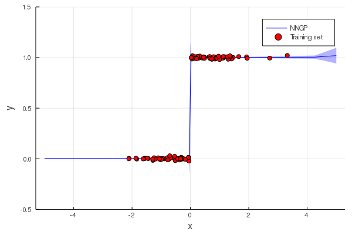

# Neural network + Gaussian process ( step function )
## Introduction
Gaussian process is typically used as a smoothing device, here, we show that by combining with a simple fully connected neural network, it's able to correctly learn sharp discontinuities.

Targeted function:
$$
\begin{gather}
y=F(x)+\epsilon,\;\epsilon\sim\mathcal{N}(0, 0.01^2)\\
F(x)=\left\{\begin{array}{rl}
    0.0 & \text{if } x\le0.0\\
    1.0 & \text{if } x>0.0
    \end{array}\right.
\end{gather}
$$

Neural network is used as a feature extractor, it can be viewed as a nonlinear transformation $T:\,x\to z$, Gaussian process with Automatic Relevance Determination (ARD) kernel is then used to map $z\to y$, the combined mapping can be represented as $y=f(T(x))$.

The results is show below:

## Reference
[1] [Deep kernel learning](https://arxiv.org/abs/1511.02222)

[2] [Manifold Gaussian Processes for Regression](https://arxiv.org/abs/1402.5876)
